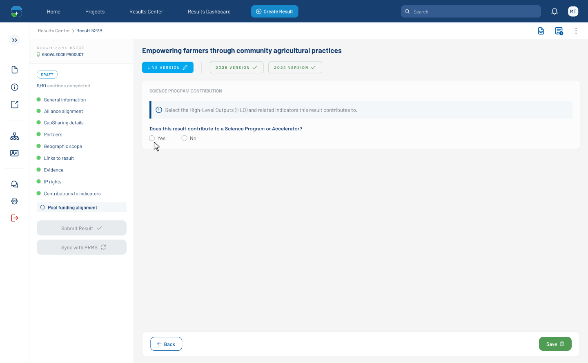

# Pool Funding Alignment — Default (SP picker closed) (Figma 32470:3149)

> **Figma node**: [`32470:3149`](https://www.figma.com/design/5a9xZJdb2rZAQm2wdk1CNT/STAR?node-id=32470-3149&m=dev) · **File key**: `5a9xZJdb2rZAQm2wdk1CNT` · **Screen tag**: `32470:3149` · **Canvas**: 1440×891
> **Maps to Jira**: **[US2 / AC-1594](../jira-us/AC-1594-us2-pool-funding-alignment.md)**
> **PRMS counterpart**: [`../prms-context/frontend-context.md`](../prms-context/frontend-context.md) §6
> **Companion node**: [US0 / AC-1413](https://cgiarmel.atlassian.net/browse/AC-1413) (mockup validation set this URL)
> **Last verified**: 2026-05-15

> Predecessor of the canonical [`32471:129337`](./32471-129337-pool-funding-alignment-sp-dropdown-open.md). This is the **entry-point view** of the Pool Funding Alignment tab: empty form, Yes/No question shown, no SP picker yet visible.

---

## Screenshot

---

## 1. Purpose

This screen is the **entry state** of the Pool Funding Alignment tab when a Researcher first opens it. No selection has been made yet. The form is bounded by a **footer options bar** (1072×75) suggesting Save / Submit / Cancel actions live there.

Same shell, same components, same tokens as the canonical [`32471:129337`](./32471-129337-pool-funding-alignment-sp-dropdown-open.md). What is different:

- **Footer options bar visible** at y=876 (1072×75) — likely Save / Discard / Submit actions.
- **No SP multiselect rendered yet** — only the Yes/No question appears in the Training Details box.
- **Yes/No question has no required marker (`*`)** here.

---

## 2. What is different from the canonical

| Element | This screen | Canonical (32471:129337) |
|---|---|---|
| `Footer options` | ✅ visible at bottom | ❌ not shown |
| SP multiselect | ❌ collapsed; not yet revealed | ✅ panel open |
| `*` on Yes/No question | ❌ absent | ❌ absent (same) |
| Result type sidebar | `form_progress_knowledgeproduct` (same) | same |

---

## 3. Verbatim text

| Where | Text |
|---|---|
| H1 result title | `Empowering farmers through community agricultural practices` |
| Section heading | `SCIENCE PROGRAM CONTRIBUTION` |
| Info banner | `Select the High-Level Outputs (HLO) and related indicators this result contributes to.` |
| Yes/No question | `Does this result contribute to a Science Program or Accelerator?` |
| Yes/No options | `Yes`, `No` |

---

## 4. Component delta

- **Adds**: `Footer options` block (1072×75) — STAR mapping: extend [`navigation-buttons`](../../../../research-indicators/src/app/shared/components/navigation-buttons) or [`form-header`](../../../../research-indicators/src/app/shared/components/form-header) into a footer variant.
- **Hides**: SP multiselect and its panel.

---

## 5. States

This screen represents the **Default / pristine** state. Transitions:

- User selects **Yes** → reveal SP multiselect input → next screen [`32471:129337`](./32471-129337-pool-funding-alignment-sp-dropdown-open.md) when picker opens.
- User selects **No** → next screen [`33528:138106`](./33528-138106-pool-funding-alignment-no-branch.md) (No branch, hides SP/HLO fields).

---

## 6. STAR fit notes

- The footer options bar is a new pattern that should sit at the **bottom of the result-detail tab**, not the page. Confirm whether STAR's existing result-detail flow already has a per-tab footer (most existing tabs do not).
- Per AC-2 of US2, this whole section is **only rendered when the project is a Pool Funding Contributor** (see [US1 / AC-1438](../jira-us/AC-1438-us1-tag-bilateral-projects.md)).

---

## 7. Open questions

- **OQ-32470-3149-A**: What Save / Submit actions live in the footer options bar? Same as the result detail's existing buttons, or specific to this tab?
- **OQ-32470-3149-B**: Does the footer remain visible while scrolling, or sticky-bottom?

---

## 8. Accessibility (WCAG 2.1 AA — PRD C-4)

Same baseline as the canonical [`32471-129337`](./32471-129337-pool-funding-alignment-sp-dropdown-open.md) §8. Specific to this state:

- Initial focus order should be: section heading → Yes radio → No radio → footer actions.
- The hidden SP picker (not yet rendered) is **not** in the tab order. Switching Yes/No must transition focus to the newly-revealed SP picker so users do not lose context.

## References

- Figma: [`32470:3149`](https://www.figma.com/design/5a9xZJdb2rZAQm2wdk1CNT/STAR?node-id=32470-3149&m=dev)
- Jira: [AC-1594](https://cgiarmel.atlassian.net/browse/AC-1594), [AC-1413 (US0 mockup validation)](https://cgiarmel.atlassian.net/browse/AC-1413)
- Canonical screen: [`32471-129337-pool-funding-alignment-sp-dropdown-open.md`](./32471-129337-pool-funding-alignment-sp-dropdown-open.md)
- Sibling state: [`33528-138394-pool-funding-alignment-default-required.md`](./33528-138394-pool-funding-alignment-default-required.md)
- No-branch sibling: [`33528-138106-pool-funding-alignment-no-branch.md`](./33528-138106-pool-funding-alignment-no-branch.md)
