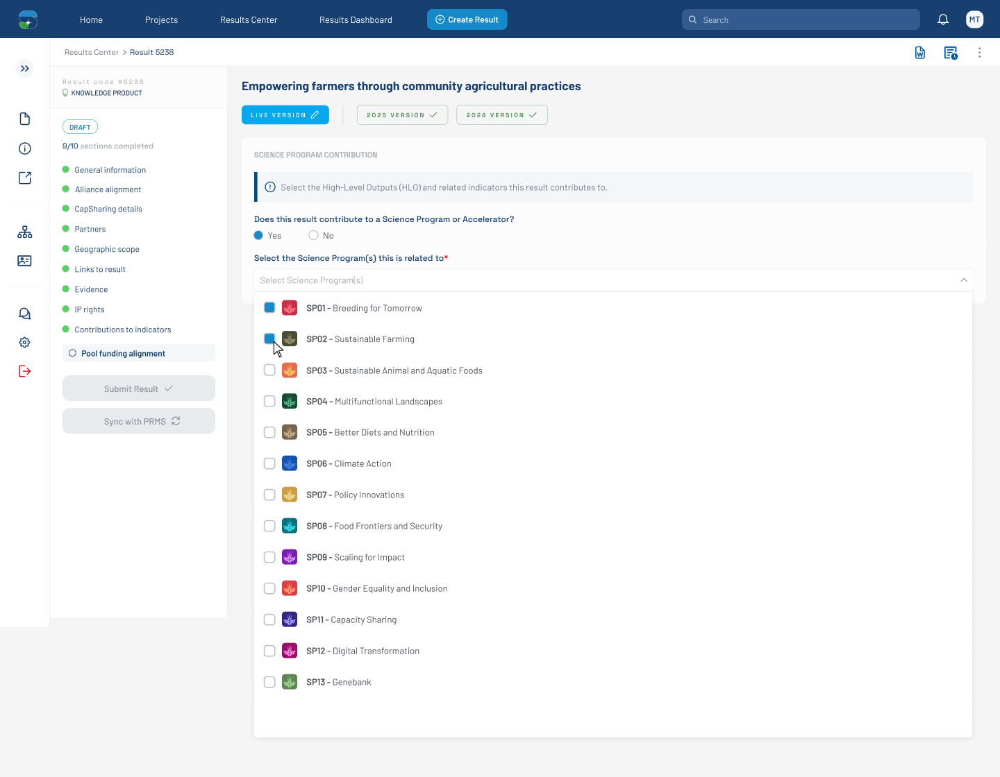

# Pool Funding Alignment — SP Dropdown Open (Figma 32471:129337)

> **Figma node**: [`32471:129337`](https://www.figma.com/design/5a9xZJdb2rZAQm2wdk1CNT/STAR?node-id=32471-129337&m=dev) · **File key**: `5a9xZJdb2rZAQm2wdk1CNT` · **Screen tag**: `32471:129337` · **Canvas**: 1440×1120
> **Maps to Jira**: **[US2 / AC-1594](../jira-us/AC-1594-us2-pool-funding-alignment.md)** — Configure Pool Funding Alignment Contribution
> **PRMS counterpart**: [`../prms-context/frontend-context.md`](../prms-context/frontend-context.md) §6 (review drawer fields) — analogous concept on PRMS side
> **Last verified**: 2026-05-15

> This is the **canonical Pool Funding Alignment screen** of the bilateral mockup set. Other Yes-branch variants reference back to this file. It captures the moment the user opens the **Select Science Program(s)** multiselect dropdown.

---

## Screenshot



---

## 1. Purpose & where it fits

This screen captures the **Pool Funding Alignment** tab inside a result-detail page, with the user actively selecting which **Science Program(s) / Accelerator(s)** the result contributes to. The result in the mockup is `Empowering farmers through community agricultural practices`. The Yes/No radio is already on **Yes**, the SP multiselect is **open**, and all 13 Science Programs are listed for selection.

This is the heart of [US2 / AC-1594](../jira-us/AC-1594-us2-pool-funding-alignment.md) and the upstream gate for [US3](../jira-us/AC-1439-us3-display-toc-indicators.md), [US4](../jira-us/AC-1440-us4-map-results-indicators.md), [US5](../jira-us/AC-1441-us5-push-results-prms.md).

---

## 2. Visual layout

```
┌───────────────────────────────────────────────────────────────────────────────┐
│ Header new                                                          1440×55   │
├──────┬──────────────────────────────────────────────────────────────────────── │
│ Side │ Section Title                                                  1368×41 │
│ bar  ├──────────────────────────────────────────────────────────────────────── │
│ clsd │  form_progress  │  Pool funding alignment tab content                  │
│ 72w  │  256×795        │  348,112 → 1072 wide                                 │
│      │                 │                                                      │
│      │                 │  H1: Empowering farmers through community agricultural│
│      │                 │      practices                          (878×21)     │
│      │                 │  Tabs strip live version                441×29       │
│      │                 │  ┌──────────────────────────────────────────────────┐ │
│      │                 │  │ Training Details                       1072×239 │ │
│      │                 │  │  SCIENCE PROGRAM CONTRIBUTION ⓘ                  │ │
│      │                 │  │  ⓘ Select the High-Level Outputs (HLO) and       │ │
│      │                 │  │     related indicators this result contributes…  │ │
│      │                 │  │                                                  │ │
│      │                 │  │  Does this result contribute to a Science       │ │
│      │                 │  │  Program or Accelerator?                         │ │
│      │                 │  │  ( ) Yes    ( ) No                               │ │
│      │                 │  │                                                  │ │
│      │                 │  │  Select the Science Program(s) this is related  │ │
│      │                 │  │  to *                                            │ │
│      │                 │  │  ┌──────────────────────────────────────┐ ▼      │ │
│      │                 │  │  │ (search input — empty)               │        │ │
│      │                 │  │  └──────────────────────────────────────┘        │ │
│      │                 │  └──────────────────────────────────────────────────┘ │
│      │                 │  ╔══════════════════════════════════════════════════╗ │
│      │                 │  ║ Dropdown panel (open)                            ║ │
│      │                 │  ║   ☐  ⭐ SP01 - Breeding for Tomorrow             ║ │
│      │                 │  ║   ☐  ⭐ SP02 - Sustainable Farming               ║ │
│      │                 │  ║   ☐  ⭐ SP03 - Sustainable Animal and Aquatic…   ║ │
│      │                 │  ║   ☐  ⭐ SP04 - Multifunctional Landscapes        ║ │
│      │                 │  ║   ☐  ⭐ SP05 - Better Diets and Nutrition        ║ │
│      │                 │  ║   ☐  ⭐ SP06 - Climate Action                    ║ │
│      │                 │  ║   ☐  ⭐ SP07 - Policy Innovations                ║ │
│      │                 │  ║   ☐  ⭐ SP08 - Food Frontiers and Security       ║ │
│      │                 │  ║   ☐  ⭐ SP09 - Scaling for Impact                ║ │
│      │                 │  ║   ☐  ⭐ SP10 - Gender Equality and Inclusion     ║ │
│      │                 │  ║   ☐  ⭐ SP11 - Capacity Sharing                  ║ │
│      │                 │  ║   ☐  ⭐ SP12 - Digital Transformation            ║ │
│      │                 │  ║   ☐  ⭐ SP13 - Genebank                          ║ │
│      │                 │  ╚══════════════════════════════════════════════════╝ │
└──────┴──────────────────────────────────────────────────────────────────────── ┘
```

- The Yes/No question label here is **without** the required marker. Compare `33528:138394`, which has it (OQ-FIG-1 in [README](./README.md)).
- The favorite-star icon next to each SP option is **hidden** in the metadata — present but not visible in this state.

---

## 3. Component inventory (Figma → STAR → PrimeNG)

| Figma element | STAR shared component | PrimeNG primitive | Notes |
|---|---|---|---|
| `Header new` (1440×55) | [`alliance-navbar`](../../../../research-indicators/src/app/shared/components/alliance-navbar) | — | Existing global navbar |
| `Side bar closed` (72×849) | [`alliance-sidebar`](../../../../research-indicators/src/app/shared/components/alliance-sidebar) | — | Collapsed variant |
| `Section Title` (1368×41) | [`section-header`](../../../../research-indicators/src/app/shared/components/section-header) | — | Page title block |
| `form_progress_knowledgeproduct` (256×795) | [`result-sidebar`](../../../../research-indicators/src/app/shared/components/result-sidebar) | — | The Pool funding alignment tab will be a new entry in this sidebar |
| Result title text | plain `<h1>` styled via STAR tokens | — | `Empowering farmers through community agricultural practices` |
| `Tabs live version` (441×29) | tab strip pattern; extend [`navigation-buttons`](../../../../research-indicators/src/app/shared/components/navigation-buttons) | `p-tabs` (wrapped) | Live tabs inside the form |
| `SCIENCE PROGRAM CONTRIBUTION` heading + info icon | [`form-header`](../../../../research-indicators/src/app/shared/components/form-header) variant | — | Uppercase tracking |
| Info banner ("Select the High-Level Outputs…") | [`alert-tag`](../../../../research-indicators/src/app/shared/components/alert-tag) or a new inline-info component | `p-message info` (wrapped) | Icon + body text, full-row |
| Yes/No radio group | [`custom-fields`](../../../../research-indicators/src/app/shared/components/custom-fields) radio variant | `p-radiobutton` (wrapped) | Two options inline; horizontal layout |
| SP multiselect (closed input) | [`dropdowns`](../../../../research-indicators/src/app/shared/components/dropdowns) multi-select variant | `p-multiselect` (wrapped) | With search input and chevron-down |
| SP dropdown panel (open, 1034×642) | same multi-select panel | `p-multiselect` overlay panel | Each row: checkbox + star + label |
| Per-row checkbox in panel | wrapped checkbox under `custom-fields` | `p-checkbox` | Hidden by default in metadata (visible when row hovered or focused) |
| Per-row star icon | new icon — favorite/pin pattern | — | Surface as OQ-FIG-2 |
| Per-row label (SP name) | text element | — | Bound to CLARISA SP name |

---

## 4. Design tokens used

| Figma variable | Hex | STAR token | Notes |
|---|---|---|---|
| `Primary Blue-500` | `#173F6F` | `--ac-primary-blue-500` | Headings, CTA accents |
| `Light Blue-300` | `#1689CA` | `--ac-light-blue-300` | Selected/active highlights |
| `Grey-100` | `#F4F7F9` | `--ac-grey-100` | Surface panel background |
| `Grey-300` / `Grey-400` | `#E8EBED` / `#B9C0C5` | `--ac-grey-300` / `--ac-grey-400` | Borders, dividers |
| `Grey-500` / `Grey-600` | `#A2A9AF` / `#8D9299` | `--ac-grey-500` / `--ac-grey-600` | Helper text |
| `Grey-800` | `#4C5158` | `--ac-grey-800` | Body text |
| `Green-200` / `Green-300` | `#A8CEAB` / `#7CB580` | `--ac-green-200` / `--ac-green-300` | Yes branch / success accents |
| `Red-1` | `#CF0808` | `--ac-red-1` | Validation errors |
| `White-1` | `#FFFFFF` | `--ac-white-1` | Panel surfaces |
| `Background` | `#F5F5F5` | `--ac-background` | Page background |
| `message/info/icon/color` | `#3B82F6` | (gap — propose `--ac-info-icon`) | The blue info-circle icon color |
| `input/icon/color` | `#6B7280` | (close to `--ac-grey-600/700`; propose semantic alias) | Chevron-down, search icons |
| `surface/900` | `#212121` | (gap — propose `--ac-surface-900`) | Reserved surface |

---

## 5. States documented on this screen

| State | What changes |
|---|---|
| **Default — Yes selected, panel open** | This screen |
| **Hover on SP option** | Row gets a subtle background (`Grey-100`) and the row checkbox becomes visible |
| **Focus on SP option (keyboard)** | Visible focus ring on the row + keyboard navigation between rows |
| **Selected SP** | Checkbox checked; checkmark color = `Primary Blue-500` or `Light Blue-300` |
| **Search typing** | Panel narrows to matching SPs; "No results" empty state when no match (not shown in this node — propose) |
| **Panel closed** | See [`32471:129636`](./32471-129636-pool-funding-alignment-sp-selected-hlo-prompt.md) for the post-selection state |

---

## 6. Interactions & behaviors

- **Yes radio** ([`32471:129356`](https://www.figma.com/design/5a9xZJdb2rZAQm2wdk1CNT/STAR?node-id=32471-129356)) — selecting **Yes** reveals the SP multiselect below; selecting **No** hides it (see [`33528:138106`](./33528-138106-pool-funding-alignment-no-branch.md)).
- **SP multiselect input** — clicking opens the panel; the chevron rotates 180°.
- **SP search** — typing filters the panel (`Grey-100` highlight on matching prefixes — confirm with designer).
- **Per-row checkbox** — clicking selects/deselects an SP; multiple selections allowed (AC-4 of US2).
- **Per-row star** — currently hidden; if exposed, propose favorite/pin semantics (OQ-FIG-2).
- **Required marker (`*`) on the SP question** — present on this screen; on the Yes/No question above it the `*` is absent here but present in `33528:138394` (OQ-FIG-1).
- **Closing the panel** — clicking outside the panel collapses it without committing selections; clicking another control commits.

---

## 7. Verbatim text & labels

| Where | Text |
|---|---|
| H1 result title | `Empowering farmers through community agricultural practices` |
| Tab strip | (label not visible at this resolution — confirm in Figma) |
| Section heading | `SCIENCE PROGRAM CONTRIBUTION` (uppercase, with info-circle icon) |
| Info banner | `Select the High-Level Outputs (HLO) and related indicators this result contributes to.` |
| Yes/No question | `Does this result contribute to a Science Program or Accelerator?` |
| Yes/No option labels | `Yes`, `No` |
| SP picker label | `Select the Science Program(s) this is related to*` |
| SP picker placeholder | (empty in this mockup — propose `Select one or more Science Programs…`) |
| SP option labels | `SP01 - Breeding for Tomorrow`, `SP02 - Sustainable Farming`, `SP03 - Sustainable Animal and Aquatic Foods`, `SP04 - Multifunctional Landscapes`, `SP05 - Better Diets and Nutrition`, `SP06 - Climate Action`, `SP07 - Policy Innovations`, `SP08 - Food Frontiers and Security`, `SP09 - Scaling for Impact`, `SP10 - Gender Equality and Inclusion`, `SP11 - Capacity Sharing`, `SP12 - Digital Transformation`, `SP13 - Genebank` |

---

## 8. Accessibility (WCAG 2.1 AA — PRD C-4)

- **Keyboard**: Tab order — result title (skip if non-interactive) → tab strip → Yes radio → No radio → SP picker → panel rows. Arrow keys navigate options within the panel; Space toggles selection; Esc closes panel.
- **Focus ring**: visible on every interactive control; uses `Light Blue-300` outline (`--ac-light-blue-300`).
- **Labels**: each radio has the question text as its accessible name; SP picker has `Select the Science Program(s) this is related to` as `aria-label`.
- **Contrast**: `Grey-800` body text on `White-1` surface ≈ 11.6:1; `Grey-500` helper text on `White-1` ≈ 3.8:1 (use only for non-essential helper text — confirm). The info-icon color `#3B82F6` on white is ≈ 3.7:1 — pair the icon with text for non-color signaling.
- **ARIA live region**: when an SP is added/removed, fire a polite live region update (e.g., "Sustainable Farming selected, 1 of 13 options chosen").
- **Motion**: chevron rotation respects `prefers-reduced-motion` (instant or short transition).
- **Touch target**: each SP row should be ≥ 44×44 pixels for touch (the row is 45 px in the mockup — already meets target).

---

## 9. STAR fit notes

- **Result tab placement**: Pool funding alignment is a **new result-detail tab** alongside `general-information`, `alliance-alignment`, `partners`, `evidence`, `capacity-sharing`, `policy-change`, `innovation-details`, `oicr-details`, `ip-rights`, `geographic-scope`, `links-to-result` (see [`research-indicators/src/app/app.routes.ts`](../../../../research-indicators/src/app/app.routes.ts)). Per **C-6** must be lazy-loaded `loadComponent`.
- **SP source**: Per AC-5 of US2, the SP options are **scoped to the bilateral project's W3 Registry contributions** — **not** the full CLARISA SP catalog. The Figma list shows all 13 SPs assuming a project that contributes to every SP; in reality the dropdown is filtered (see [`../jira-us/AC-1594-us2-pool-funding-alignment.md`](../jira-us/AC-1594-us2-pool-funding-alignment.md) AC-5).
- **Tokens**: 1:1 with STAR's `--ac-*` system. Three minor token gaps noted in [README](./README.md) §5.
- **Permission**: per AC-7 of US2, only Creator / PI / contact / admins can edit (see [`../prms-context/frontend-context.md`](../prms-context/frontend-context.md) §10 for parallel pattern; **never** flip global `roles.service.readOnly`).
- **Dark mode**: respect STAR's `--ac-*` token swap; PrimeNG Aura preset handles the rest. No hex literals.
- **State management**: domain service `bilateral-alignment.service.ts` with signals — picker state, selected SPs, dirty flag, save-required flag.

---

## 10. Open questions

- **OQ-FIG-1** ([README](./README.md) §7): Is `*` required on the Yes/No question? This mockup omits it; `33528:138394` shows it.
- **OQ-FIG-2** ([README](./README.md)): Star icon semantics — favorite-SP? pin to top?
- **OQ-32471-129337-A**: When fewer than 13 SPs apply to the project (the actual AC-5 case), how does the dropdown size adjust? Show all available with no padding, or expand vertically up to a max-height with scroll?
- **OQ-32471-129337-B**: Empty-state copy when search yields no matches.
- **OQ-32471-129337-C**: Select-all behavior — is there a "Select all" action at the top of the panel? Not present in the mockup.

---

## References

- Figma: [`32471:129337`](https://www.figma.com/design/5a9xZJdb2rZAQm2wdk1CNT/STAR?node-id=32471-129337&m=dev)
- Jira: [AC-1594](https://cgiarmel.atlassian.net/browse/AC-1594) — see [`../jira-us/AC-1594-us2-pool-funding-alignment.md`](../jira-us/AC-1594-us2-pool-funding-alignment.md)
- PRMS counterpart: [`../prms-context/frontend-context.md`](../prms-context/frontend-context.md) §6 (review drawer), §13 (federation data)
- Predecessor screen: [`32470-3149-pool-funding-alignment-default.md`](./32470-3149-pool-funding-alignment-default.md) (panel closed)
- Successor screen: [`32471-129636-pool-funding-alignment-sp-selected-hlo-prompt.md`](./32471-129636-pool-funding-alignment-sp-selected-hlo-prompt.md) (after SPs selected)
- STAR PRD: [`../../../prd.md`](../../../prd.md) §3 personas, §8.3 constraints
- STAR system design: [`../../../system-design/design.md`](../../../system-design/design.md) §7 tokens, §8 components
