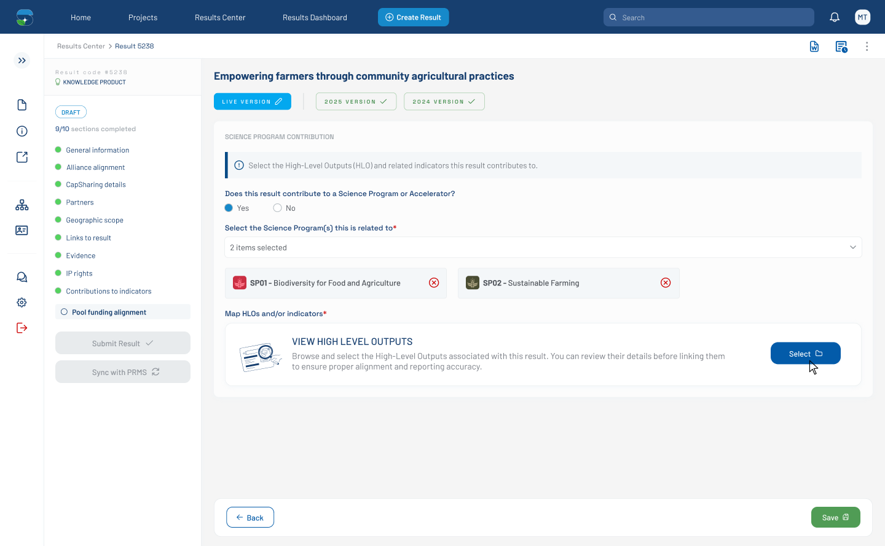

# Pool Funding Alignment — SP Selected, HLO Prompt (Figma 32471:129636)

> **Figma node**: [`32471:129636`](https://www.figma.com/design/5a9xZJdb2rZAQm2wdk1CNT/STAR?node-id=32471-129636&m=dev) · **File key**: `5a9xZJdb2rZAQm2wdk1CNT` · **Screen tag**: `32471:129636` · **Canvas**: 1440×891
> **Maps to Jira**: **[US2 / AC-1594](../jira-us/AC-1594-us2-pool-funding-alignment.md)** → bridges to **[US3 / AC-1439](../jira-us/AC-1439-us3-display-toc-indicators.md)**
> **Last verified**: 2026-05-15

> Successor of the canonical [`32471:129337`](./32471-129337-pool-funding-alignment-sp-dropdown-open.md). After the user has selected one or more SPs, the dropdown collapses and a new **"Map HLOs and/or indicators"** prompt + AI card appears.

---

## Screenshot



---

## 1. Purpose

This screen shows the state **after** the user has selected SPs in the dropdown. The dropdown panel is closed. A new block appears below the SP picker prompting the user to map HLOs and indicators — the gateway into [US3 (Display ToC Indicators)](../jira-us/AC-1439-us3-display-toc-indicators.md) and [US4 (Map results to indicators)](../jira-us/AC-1440-us4-map-results-indicators.md).

---

## 2. Visual layout (deltas only)

Adds **two new sub-sections** below the SP picker:

1. **`Frame 1171276796`** at y=239 (740×49) — a horizontal row, conceptually a placeholder for the **selected SP chips / data-views** (compare `32471:131617` and `33563:138613` which show two `dataview` instances at 361×50 each).
2. **`Frame 1171276797`** at y=306 (1036×125) — the **"Map HLOs and/or indicators*"** label + an **AI card** below.

The AI card structure (1036×103):

```
┌────────────────────────────────────────────────────────────────────────┐
│ [73×73 graphic]    VIEW HIGH LEVEL OUTPUTS                  [Upload file]│
│                    Browse and select the High-Level Outputs              │
│                    associated with this result. You can review their     │
│                    details before linking them to ensure proper alignment│
│                    and reporting accuracy.                               │
└────────────────────────────────────────────────────────────────────────┘
```

- Left graphic: a custom illustration (`Seo-3--Streamline-Brooklyn 1`).
- Title (uppercase): `VIEW HIGH LEVEL OUTPUTS`.
- Body: `Browse and select the High-Level Outputs associated with this result. You can review their details before linking them to ensure proper alignment and reporting accuracy.`
- Action button: **`Upload file`** (114×36) with a `folder` icon. **(See OQ-FIG-5 — the button copy says "Upload file" but the action launches the HLO selection modal; this is a likely copy mismatch.)**

---

## 3. Component delta (additions)

| Figma element | STAR shared component | PrimeNG primitive | Notes |
|---|---|---|---|
| Selected-SP chips row (`Frame 1171276796`) | extend [`custom-tag`](../../../../research-indicators/src/app/shared/components/custom-tag) into a chip-bar pattern | `p-chip` | Placeholder in this state; populated when SPs are selected |
| `Map HLOs and/or indicators*` label | label component (already wrapped in form patterns) | — | Required marker |
| **AI card** (1036×103) | **new component** — propose `bilateral-action-card` or extend [`metadata-panel`](../../../../research-indicators/src/app/shared/components/metadata-panel) | — | Illustration + title + body + green CTA button |
| `Upload file` button | wrapped button | `p-button` (wrapped) | Action: open the HLO modal — see [`32471:131617`](./32471-131617-hlo-modal-empty.md) |
| `folder` icon | primeicon — `pi pi-folder` or custom | — | Inside the button |
| `check` icon | primeicon — hidden by default | — | Shown when the action has completed |

---

## 4. Verbatim text (new in this state)

| Where | Text |
|---|---|
| HLO section label | `Map HLOs and/or indicators*` |
| AI-card title | `VIEW HIGH LEVEL OUTPUTS` |
| AI-card body | `Browse and select the High-Level Outputs associated with this result. You can review their details before linking them to ensure proper alignment and reporting accuracy.` |
| AI-card CTA | `Upload file` *(suspected copy error — should likely be `View HLOs` or `Open selector`)* |

---

## 5. STAR fit notes

- The **AI card** is the entry point to the HLO selection flow. Implementing it as a reusable component (e.g., `bilateral-action-card`) lets us reuse the visual treatment in other "open modal" entry points if STAR's design system later wants it.
- Confirm the button copy with the designer (**OQ-FIG-5**). If it stays `Upload file`, then this card actually accepts file uploads (e.g., a bulk-indicator template) — which is a different flow than US3 (display indicators) → US4 (map them). Important to disambiguate.
- The placeholder row at y=239 (740×49) becomes populated once SPs are selected — see `32471:131617` and `33563:138613` for shapes.

---

## 6. Open questions

- **OQ-FIG-5** ([README](./README.md)): "Upload file" button copy — error or intentional?
- **OQ-32471-129636-A**: What chips / dataviews appear in the `Frame 1171276796` placeholder once SPs are selected? Confirm chip layout in `32471:131617` / `33563:138613`.

---

## 7. Accessibility (WCAG 2.1 AA — PRD C-4)

Same baseline as the canonical [`32471-129337`](./32471-129337-pool-funding-alignment-sp-dropdown-open.md) §8. Specific to this state:

- The **AI card** is a custom region — give it `role="region"` and `aria-labelledby` pointing at the `VIEW HIGH LEVEL OUTPUTS` heading.
- The CTA inside the card is keyboard-reachable; the `folder` icon is decorative and gets `aria-hidden="true"`.
- When the card body wraps onto multiple lines, ensure line spacing meets the **1.5× line-height** recommendation for body text.

## References

- Figma: [`32471:129636`](https://www.figma.com/design/5a9xZJdb2rZAQm2wdk1CNT/STAR?node-id=32471-129636&m=dev)
- Jira: [AC-1594](https://cgiarmel.atlassian.net/browse/AC-1594), [AC-1439 (US3)](https://cgiarmel.atlassian.net/browse/AC-1439)
- Predecessor: [`32471-129337-pool-funding-alignment-sp-dropdown-open.md`](./32471-129337-pool-funding-alignment-sp-dropdown-open.md)
- Successor (modal opens): [`32471-131617-hlo-modal-empty.md`](./32471-131617-hlo-modal-empty.md)
