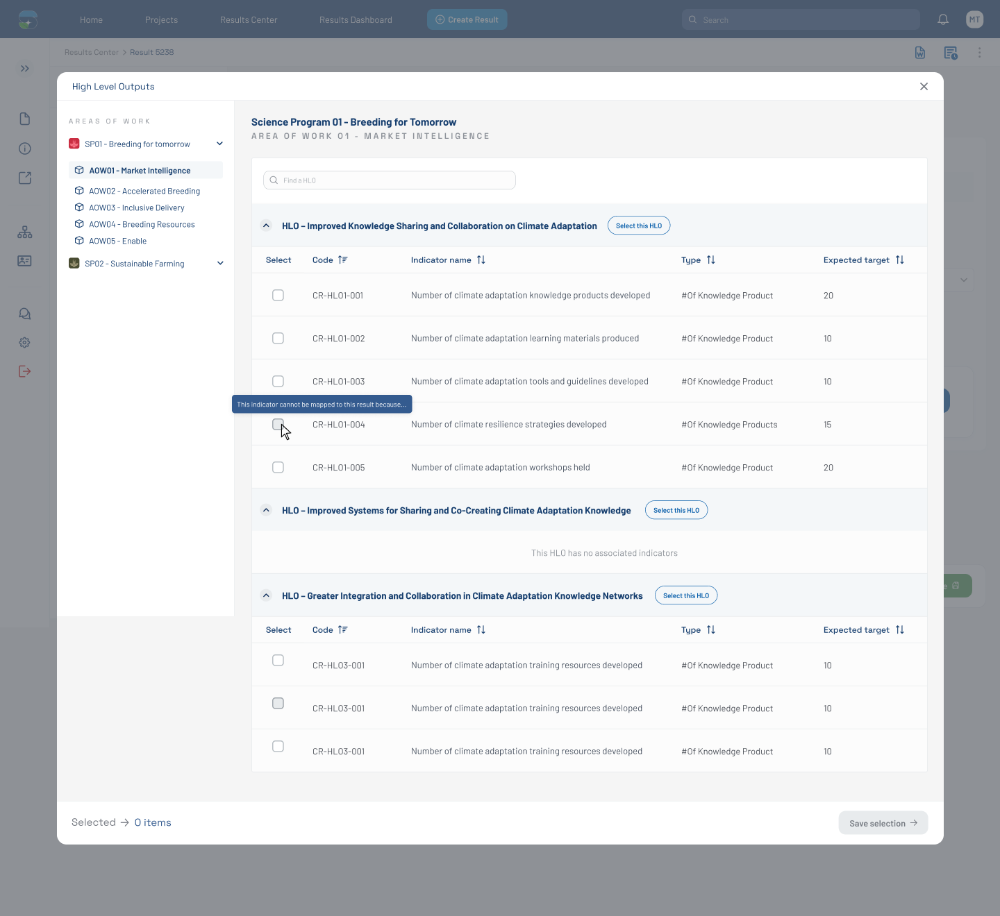

# HLO Selection Modal — 0 items selected (Figma 32471:131617)

> **Figma node**: [`32471:131617`](https://www.figma.com/design/5a9xZJdb2rZAQm2wdk1CNT/STAR?node-id=32471-131617&m=dev) · **File key**: `5a9xZJdb2rZAQm2wdk1CNT` · **Screen tag**: `32471:131617` · **Canvas**: 1440×1320
> **Maps to Jira**: **[US3 / AC-1439](../jira-us/AC-1439-us3-display-toc-indicators.md)** — Display ToC Indicators
> **PRMS counterpart**: [`../prms-context/frontend-context.md`](../prms-context/frontend-context.md) §6.5 (ToC editing — PRMS embeds `app-cp-multiple-wps`)
> **Last verified**: 2026-05-15

> This is the **HLO selection modal**, opened from the AI card on [`32471:129636`](./32471-129636-pool-funding-alignment-sp-selected-hlo-prompt.md). Initial state: **0 items selected**.

---

## Screenshot



---

## 1. Purpose

This is the **canonical HLO selection modal** of the bilateral mockup set. It overlays the Pool Funding Alignment form. Users see the SPs they have selected as expandable trees (with their **Areas of Work**) in a left sidebar, and a results table on the right where they can pick specific HLOs / indicators to map to the result.

This screen drives [US3 (display indicators per SP)](../jira-us/AC-1439-us3-display-toc-indicators.md) and the upstream half of [US4 (mapping rules)](../jira-us/AC-1440-us4-map-results-indicators.md).

The result-detail title changes here: `Climate-Smart agricultural practices` (vs the prior `Empowering farmers through community agricultural practices`) — the mockup uses a different result example to populate the modal.

---

## 2. Visual layout

```
┌────────────────────────────────────────────────────────────────────────────────┐
│ Backing form (1440×1665) — same as 32471:129636, dimmed                       │
├────────────────────────────────────────────────────────────────────────────────┤
│ submit_popup (modal, 1277×1113 at 82,104)                                     │
│ ┌───────────────────────────────────────────────────────────────────────────┐ │
│ │ High Level Outputs                                                  [×]   │ │
│ ├──────────┬────────────────────────────────────────────────────────────────┤ │
│ │ Sidebar  │  Frame 1171276800: "Science Program 01 - Breeding for Tomorrow"│ │
│ │ (256×743)│    AREA OF WORK 01 - MARKET INTELLIGENCE                       │ │
│ │          │                                                                │ │
│ │ AREAS OF │  Default my results table (974×886)                            │ │
│ │ WORK     │    table-header (1171×81, hidden) — Find results / Create new  │ │
│ │          │    table-header (974×65) — search input + secondary input      │ │
│ │ ⓘ SP01 - │    Table Filter (974×801)                                      │ │
│ │ Breeding │      thead: Select / [4 unnamed columns]                       │ │
│ │ for tom… │      tbody × multiple rows (each 974×62)                       │ │
│ │  ▲ AOW01 │        - row 0: checkbox + button (974×62)                     │ │
│ │   MarketI│        - row 1: checkbox + 6 cells (1172×62)                   │ │
│ │   AOW02  │        - row 2: checkbox + 6 cells (974×62) [tree-toggler]     │ │
│ │   AOW03  │        - row 3: same                                           │ │
│ │   AOW04  │        - row 4: same                                           │ │
│ │   AOW05  │        - row 5: checkbox + button                              │ │
│ │ ⓘ SP02 - │        - row 6: full-width content (1018×62)                   │ │
│ │ Sustaina │        - row 7: checkbox + button                              │ │
│ │  ble Far │      thead (repeated): Select / [4 unnamed columns]            │ │
│ │  ming ▼  │      tbody × multiple rows                                     │ │
│ │          │                                                                │ │
│ ├──────────┴────────────────────────────────────────────────────────────────┤ │
│ │ Footer (1277×63): "Selected → 0 items"                  [buttons 128×33]  │ │
│ └───────────────────────────────────────────────────────────────────────────┘ │
└────────────────────────────────────────────────────────────────────────────────┘
```

The modal has three zones: **left sidebar** (SP/AOW tree), **center content** (results table for the active AOW), **footer** (selection counter + action buttons).

---

## 3. Component inventory (key additions)

| Figma element | STAR mapping | Notes |
|---|---|---|
| `submit_popup` modal | [`all-modals`](../../../../research-indicators/src/app/shared/components/all-modals) + [`modal`](../../../../research-indicators/src/app/shared/components/modal) host with `p-dialog` (wrapped) | Full-width modal (1277 wide) |
| Modal header (`Frame 427320321`) | extend `modal` chrome | Title + close icon |
| Close icon | `Close/Outline/Simple` instance | — |
| Left side bar (`Side bar`, 256×743) | new component or reuse [`section-sidebar`](../../../../research-indicators/src/app/shared/components/section-sidebar) | Lists SPs with collapsible AOW children |
| SP heading inside sidebar | `Frame 1171276738` | "SP01 - Breeding for tomorrow", with up/down angle icon |
| AOW item with selection box (selected) | `Frame 427320022` (highlighted) | `AOW01 - Market Intelligence` is the active AOW; styled with `Rectangle 5736` background |
| AOW item without selection | `Frame 427320030..032/029` | `AOW02..AOW05` |
| Active-area-of-work header (right top) | `Frame 1171276800` | Shows the breadcrumb: SP name + AOW name |
| Results table | extend [`results-table`](../../../../research-indicators/src/app/shared/components/results-table) | Multi-column with tree-togglers and checkboxes per row |
| Row checkbox | wrapped checkbox | Multi-select within the table |
| Row tree-toggler (`_tree-toggler`) | new icon (chevron-right / chevron-down) | Expandable indicator row |
| Row content (`_table-content`) | text | Indicator name / target / etc. |
| Action button per row (some rows) | wrapped button | Cell-level action (e.g., "Add", "Detail") |
| Table header search input | wrapped input | Live filter |
| Modal footer | `Frame 1171276888` | Counter on left, buttons on right |
| Footer "Selected → 0 items" | text + `arrow-right` icon + counter text | Live updates as user toggles checkboxes |
| Footer action buttons | `buttons` instance (128×33) | Likely Cancel / Add / Confirm |

---

## 4. Verbatim text

| Where | Text |
|---|---|
| Modal title | `High Level Outputs` |
| Sidebar section | `AREAS OF WORK` |
| Sidebar SP example | `SP01 - Breeding for tomorrow`, `SP02 - Sustainable Farming` |
| Sidebar AOW items | `AOW01 - Market Intelligence`, `AOW02 - Accelerated Breeding`, `AOW03 - Inclusive Delivery`, `AOW04 - Breeding Resources`, `AOW05 - Enable` |
| Right breadcrumb top | `Science Program 01 - Breeding for Tomorrow` |
| Right breadcrumb sub | `AREA OF WORK 01 - MARKET INTELLIGENCE` |
| Footer counter | `Selected` (label) + `0 items` (value) |
| Top-right table action (hidden in this view) | `Create new result` (with `+` icon) |

---

## 5. States documented on this screen

- **Default open — 0 items selected** (this screen).
- Sibling: **disabled-indicator state** with hover/tooltip → [`33563:138613`](./33563-138613-hlo-modal-disabled-reason.md).
- Sibling: **3 items selected** → [`33563:137770`](./33563-137770-hlo-modal-3-items-selected.md).
- The modal close action returns the user to the form.

---

## 6. STAR fit notes

- **Critical risk** (mirrors PRMS): porting or replacing the **ToC tree widget**. PRMS uses `app-cp-multiple-wps` (see [`../prms-context/frontend-context.md`](../prms-context/frontend-context.md) §6.5 OQ-2). STAR has no equivalent today. The HLO modal here is **structurally simpler** than PRMS's ToC tree (a SP+AOW tree on the left, an indicators table on the right), so STAR may build a simpler bespoke widget rather than port the PRMS component.
- The Pool funding alignment area is closely linked to **CLARISA** for SPs and **the ToC service / PRMS** for HLO catalogs (see [US7 / AC-1595](../jira-us/AC-1595-us7-sync-sp-toc.md)).
- Per **C-6**: modal opens inline via `loadComponent` if it's lazy; otherwise routed through `all-modals`.

---

## 6b. Accessibility (WCAG 2.1 AA — PRD C-4)

- **Modal contract**: focus trap inside `submit_popup`; first focusable element on open is the sidebar SP item, or the search input if it is sticky-visible. Esc closes (returns focus to the AI-card CTA on [`32471:129636`](./32471-129636-pool-funding-alignment-sp-selected-hlo-prompt.md)).
- **Sidebar tree**: `role="tree"`, with `role="treeitem"` on each SP/AOW. Expand state via `aria-expanded`. Arrow-key navigation between items.
- **Table**: `role="grid"`; rows are selectable with `aria-selected`. Column headers `role="columnheader"`. The hidden columns (e.g., status filters) must not be in the tab order while hidden.
- **Footer counter**: live-region (`aria-live="polite"`) so selection count is announced.
- **Body scroll**: prevented while the modal is open; restore on close.
- **Color contrast**: AOW selection highlight (`Rectangle 5736`) on the active row must meet 3:1 against the surrounding sidebar background.

## 7. Open questions

- **OQ-FIG-3** ([README](./README.md)): AOW relationship to ToC levels — confirm taxonomy.
- **OQ-FIG-6** ([README](./README.md)): Grouping in the modal — SP → AOW → HLO is what the sidebar suggests; confirm the table content does aggregate by AOW.
- **OQ-32471-131617-A**: What are the 4 unnamed table columns? Confirm in Figma — likely indicator name / target / status / actions.
- **OQ-32471-131617-B**: When the user opens the modal with multiple SPs selected (per AC-4 of US2), does the sidebar list all selected SPs or just the active one?

---

## References

- Figma: [`32471:131617`](https://www.figma.com/design/5a9xZJdb2rZAQm2wdk1CNT/STAR?node-id=32471-131617&m=dev)
- Jira: [AC-1439 (US3)](https://cgiarmel.atlassian.net/browse/AC-1439), [AC-1440 (US4)](https://cgiarmel.atlassian.net/browse/AC-1440)
- Predecessor: [`32471-129636-pool-funding-alignment-sp-selected-hlo-prompt.md`](./32471-129636-pool-funding-alignment-sp-selected-hlo-prompt.md)
- Sibling states: [`33563-138613-hlo-modal-disabled-reason.md`](./33563-138613-hlo-modal-disabled-reason.md), [`33563-137770-hlo-modal-3-items-selected.md`](./33563-137770-hlo-modal-3-items-selected.md)
- PRMS counterpart: [`../prms-context/frontend-context.md`](../prms-context/frontend-context.md) §6.5
