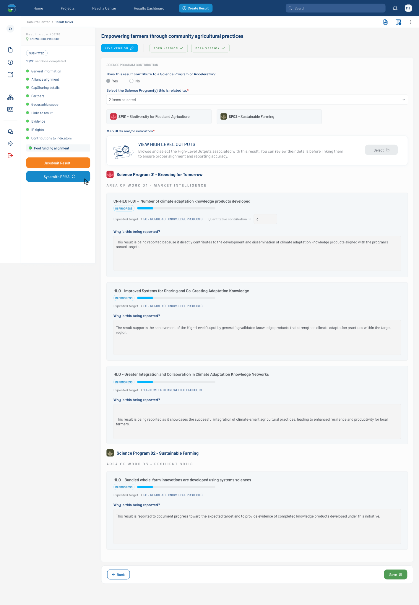

# Pool Funding Alignment — Filled Form with Quantitative Contribution (Figma 32472:129409)

> **Figma node**: [`32472:129409`](https://www.figma.com/design/5a9xZJdb2rZAQm2wdk1CNT/STAR?node-id=32472-129409&m=dev) · **File key**: `5a9xZJdb2rZAQm2wdk1CNT` · **Screen tag**: `32472:129409` · **Canvas**: 1440×2080
> **Maps to Jira**: **[US4 / AC-1440](../jira-us/AC-1440-us4-map-results-indicators.md)** — Map results to indicators (contribution rules)
> **Last verified**: 2026-05-15

> Variant of [`33356:11075`](./33356-11075-pool-funding-alignment-filled-empty-reason.md) emphasizing the **`Quantitative contribution`** sub-field on the first HLO card and a slightly different second HLO card layout (no Quantitative contribution row).

---

## Screenshot

---

## 1. Purpose & delta

The first HLO card now shows the **Quantitative contribution** sub-row prominently — implying this is an indicator where the user must record a numeric contribution alongside the qualitative reason. Subsequent HLO cards (`Frame 1171276809`, `Frame 1171276810`) **lack** the Quantitative contribution row, suggesting this field is **per-indicator** rather than per-card.

Compared to `33356:11075`:

- First HLO card body: 247 px tall (includes Quantitative contribution row).
- Subsequent HLO cards: 229 px (no Quantitative contribution row).
- The card `Frame 1171276796` placeholder above is shorter (49 vs 50 px) — minor design tweak; functional impact negligible.

---

## 2. Component delta

| Figma element | STAR mapping | Notes |
|---|---|---|
| `Frame 1171276603` — Quantitative contribution row | new layout: label + arrow + small dropdown | Only present on HLOs marked quantitative |
| Small 79×33 dropdown | [`dropdowns`](../../../../research-indicators/src/app/shared/components/dropdowns) compact | Source list per indicator |
| Subsequent HLO cards (without Quantitative row) | same `dataview` + `metadata-panel` extension | Conditional rendering |

---

## 3. Verbatim text (delta)

| Where | Text |
|---|---|
| Quantitative contribution label | `Quantitative contribution` |

All other strings match [`33356:11075`](./33356-11075-pool-funding-alignment-filled-empty-reason.md) §4.

---

## 4. States

This screen represents a **filled state with quantitative-contribution capture in progress**. The Quantitative contribution dropdown appears empty here.

---

## 5. STAR fit notes

- The Quantitative contribution field should be **conditionally rendered** based on a `is_quantitative` flag on the indicator metadata. Frontend reads the flag from the indicator catalog (US7).
- Form model: add `quantitativeContribution: FormControl<number | null>` to the per-HLO sub-form only when applicable.
- Per **C-3 (CLARISA)**: the contribution unit (e.g., "NUMBER OF KNOWLEDGE PRODUCTS") is sourced from the indicator metadata — not configurable in the UI.

---

## 5b. Accessibility (WCAG 2.1 AA — PRD C-4)

- The compact 79×33 dropdown for Quantitative contribution should still meet the 44×44 touch target — increase tap area via padding without changing the visual.
- The metric row pattern (label → `arrow-right` → value) uses the icon as decoration; mark `aria-hidden="true"` and announce the label/value as adjacent text.
- Cards that have the Quantitative row vs those that don't differ in height — ensure focus order is stable and predictable across cards.

## 6. Open questions

- **OQ-32472-129409-A**: Confirm `is_quantitative` flag source. Is it on the indicator entity in CLARISA / ToC catalog (synced via US7), or computed?
- **OQ-32472-129409-B**: Validation rules for the quantitative value — integer? non-negative? bounded by the Expected target?

---

## References

- Figma: [`32472:129409`](https://www.figma.com/design/5a9xZJdb2rZAQm2wdk1CNT/STAR?node-id=32472-129409&m=dev)
- Jira: [AC-1440 (US4)](https://cgiarmel.atlassian.net/browse/AC-1440)
- Sibling base: [`33356-11075-pool-funding-alignment-filled-empty-reason.md`](./33356-11075-pool-funding-alignment-filled-empty-reason.md)
- Successor (synced state): [`33356-11736-pool-funding-alignment-synchronized.md`](./33356-11736-pool-funding-alignment-synchronized.md)
