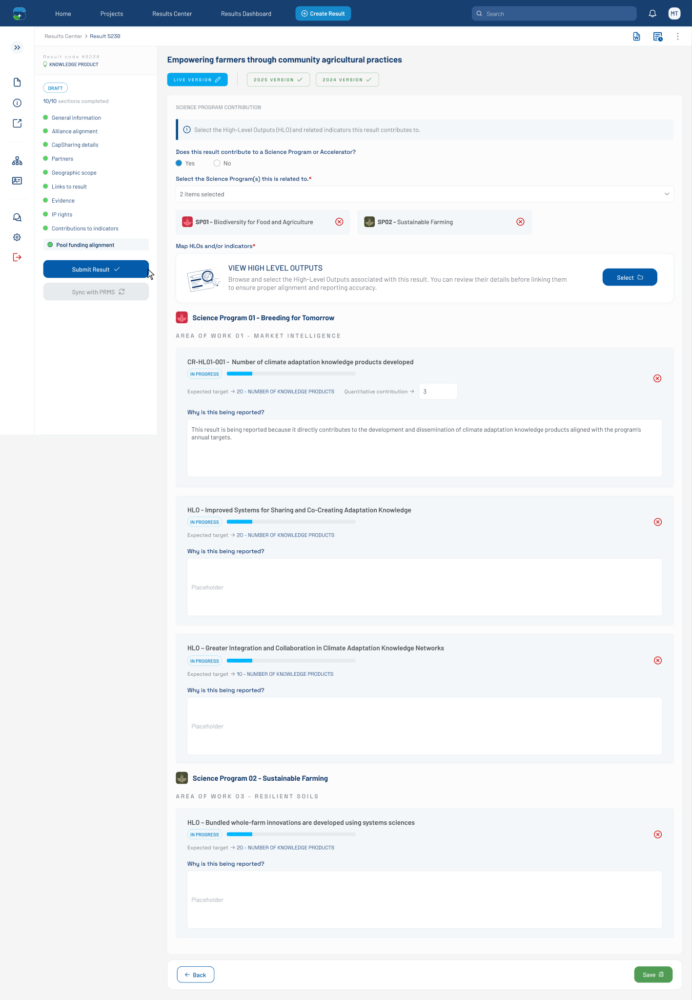

# Pool Funding Alignment — Filled Mapping Form (Figma 33356:11075)

> **Figma node**: [`33356:11075`](https://www.figma.com/design/5a9xZJdb2rZAQm2wdk1CNT/STAR?node-id=33356-11075&m=dev) · **File key**: `5a9xZJdb2rZAQm2wdk1CNT` · **Screen tag**: `33356:11075` · **Canvas**: 1440×2080
> **Maps to Jira**: **[US4 / AC-1440](../jira-us/AC-1440-us4-map-results-indicators.md)** — Map results to indicators
> **Last verified**: 2026-05-15

> Successor of [`33563:137770`](./33563-137770-hlo-modal-3-items-selected.md). The HLO modal has been confirmed; the form now shows the **mapped HLOs grouped by SP / AOW**, each with a `Why is this being reported?` dropdown awaiting input.

---

## Screenshot

---

## 1. Purpose

The user has closed the HLO modal and the form now renders the **selected HLOs as cards grouped by SP and AOW**. Each HLO card has metadata (progress, expected target) and a `Why is this being reported?` reason dropdown that is **still empty** in this state.

This is the densest screen of the mockup set (2080 px tall). It captures the **post-mapping detail view** that the user will progressively fill with contribution reasons before submission.

---

## 2. Visual layout (sections)

The form body is 1819 px tall and breaks into:

1. **`Frame 1171276882`** — SP01 header: `Science Program 01 - Breeding for Tomorrow` with a "Favicon - B4T 1" icon (24×24).
2. **`AREA OF WORK 01 - MARKET INTELLIGENCE`** subheader (uppercase, 342×15).
3. **`Frame 1171276358 / dataview`** — first HLO card (1036×290): indicator `CR-HL01-001 - Number of climate adaptation knowledge products developed`, status tag `IN PROGRESS`, progress bar, two sub-rows:
   - `Expected target → 20 - NUMBER OF KNOWLEDGE PRODUCTS`
   - `Quantitative contribution → [dropdown]`
4. **Reason row**: `Why is this being reported?` label + empty dropdown.
5. **`Frame 1171276802 / dataview`** — second HLO card (1036×269): indicator `HLO - Improved Systems for Sharing and Co-Creating Adaptation Knowledge`.
6. Repeats for more HLOs.
7. **`Frame 1171276883`** — SP02 header: `Science Program 02 - Sustainable Farming`.
8. **`AREA OF WORK 03 - RESILIENT SOILS`** subheader.
9. More HLO cards under SP02.

Each HLO card has a `times-circle` button (16×16) in the top-right corner — **removes the HLO from the mapping**.

---

## 3. Component inventory (key additions)

| Figma element | STAR mapping | Notes |
|---|---|---|
| SP group header (`Frame 1171276882/3`) | new compact component `bilateral-sp-header` (icon + name) | 24-px favicon + text |
| AOW subheader | typography utility class (uppercase, tracked) | — |
| HLO card (`dataview`) | extend [`metadata-panel`](../../../../research-indicators/src/app/shared/components/metadata-panel) | Top header row + content rows |
| Status tag `IN PROGRESS` | [`custom-tag`](../../../../research-indicators/src/app/shared/components/custom-tag) | Color: light green (`Green-200/300`) |
| Progress bar | [`custom-progress-bar`](../../../../research-indicators/src/app/shared/components/custom-progress-bar) | 268×8, partial fill |
| Inline metric row (`Expected target → 20…`) | new compact pattern (label + arrow + value) | — |
| Quantitative-contribution mini-dropdown (79×33) | [`dropdowns`](../../../../research-indicators/src/app/shared/components/dropdowns) — small variant | — |
| `times-circle` remove icon | wrapped icon button | Removes the HLO from selection |
| `Why is this being reported?` field | full-width [`dropdowns`](../../../../research-indicators/src/app/shared/components/dropdowns) with search | 988×119 panel |
| `Helper Text` (hidden) | helper-text pattern | Available for validation errors |

---

## 4. Verbatim text (representative)

| Where | Text |
|---|---|
| SP01 header | `Science Program 01 - Breeding for Tomorrow` |
| AOW subheader | `AREA OF WORK 01 - MARKET INTELLIGENCE` |
| HLO card 1 title | `CR-HL01-001 - Number of climate adaptation knowledge products developed` |
| Status tag | `IN PROGRESS` |
| Metric label 1 | `Expected target` |
| Metric value 1 | `20 - NUMBER OF KNOWLEDGE PRODUCTS` |
| Metric label 2 | `Quantitative contribution` |
| Reason field label | `Why is this being reported?` |
| HLO card 2 title | `HLO - Improved Systems for Sharing and Co-Creating Adaptation Knowledge` |
| HLO card 3 title (other SP) | `HLO – Bundled whole-farm innovations are developed using systems sciences` |
| HLO card 4 title (variant) | `HLO – Greater Integration and Collaboration in Climate Adaptation Knowledge Networks` |
| SP02 header | `Science Program 02 - Sustainable Farming` |
| AOW subheader 2 | `AREA OF WORK 03 - RESILIENT SOILS` |

---

## 5. States

- **Filled, reasons empty** (this screen).
- See [`33356:12370`](./33356-12370-pool-funding-alignment-filled-reason.md) for the above-fold filled-reason state.
- See [`32472:129409`](./32472-129409-pool-funding-alignment-filled-with-quantitative.md) for the variant where the **Quantitative contribution** sub-field is active.
- See [`33356:11736`](./33356-11736-pool-funding-alignment-synchronized.md) for the **synchronized-with-PRMS** state.

---

## 6. STAR fit notes

- **Performance**: with 3–10+ HLO cards rendered, use `*ngFor` with `trackBy`. Heavy cards (with dropdowns) should consider OnPush change detection.
- **Form model**: each HLO card has its own sub-form (reason, quantitative contribution, etc.); the parent form is a `FormArray` indexed by HLO id.
- **Grouping**: SP → AOW → HLO is implied by the visual hierarchy. The data model should match (group result→pool-funding mapping by SP and AOW before render).
- **Required validation**: per [US4](../jira-us/AC-1440-us4-map-results-indicators.md), the rules are open (OQ-G). Confirm before adding `required` validators.

---

## 6b. Accessibility (WCAG 2.1 AA — PRD C-4)

- The form is **tall**: 1819 px content height. Provide skip links so keyboard users can jump between SP groups (e.g., `Skip to Science Program 02 - Sustainable Farming`).
- Each HLO card is a `role="region"` with `aria-labelledby` pointing at its title text (e.g., `CR-HL01-001 - Number of climate adaptation knowledge products developed`).
- The `times-circle` remove button on each card has `aria-label="Remove indicator <name>"`; removal triggers a polite live-region announcement (`"Indicator removed"`).
- The status tag `IN PROGRESS` is paired with the progress-bar value — ensure the progress-bar has an `aria-valuenow` matching the displayed fill (53/268 in the mockup ≈ 20%).
- The `Why is this being reported?` dropdown is a large (988×119) overlay; ensure keyboard-typeahead works and that focus returns to the dropdown trigger on close.

## 7. Open questions

- **OQ-FIG-6** ([README](./README.md)): Confirm grouping hierarchy (SP → AOW → HLO).
- **OQ-33356-11075-A**: Are HLOs always grouped by both SP and AOW, or can an HLO live directly under an SP without an AOW?
- **OQ-33356-11075-B**: Empty-state copy when the user picks an HLO but no reason — does submission gate on this?
- **OQ-33356-11075-C**: Maximum number of HLO cards before pagination/lazy-loading is needed?

---

## References

- Figma: [`33356:11075`](https://www.figma.com/design/5a9xZJdb2rZAQm2wdk1CNT/STAR?node-id=33356-11075&m=dev)
- Jira: [AC-1440 (US4)](https://cgiarmel.atlassian.net/browse/AC-1440)
- Predecessor (modal confirm): [`33563-137770-hlo-modal-3-items-selected.md`](./33563-137770-hlo-modal-3-items-selected.md)
- Sibling states: [`33356-12370-pool-funding-alignment-filled-reason.md`](./33356-12370-pool-funding-alignment-filled-reason.md), [`32472-129409-pool-funding-alignment-filled-with-quantitative.md`](./32472-129409-pool-funding-alignment-filled-with-quantitative.md), [`33356-11736-pool-funding-alignment-synchronized.md`](./33356-11736-pool-funding-alignment-synchronized.md)
