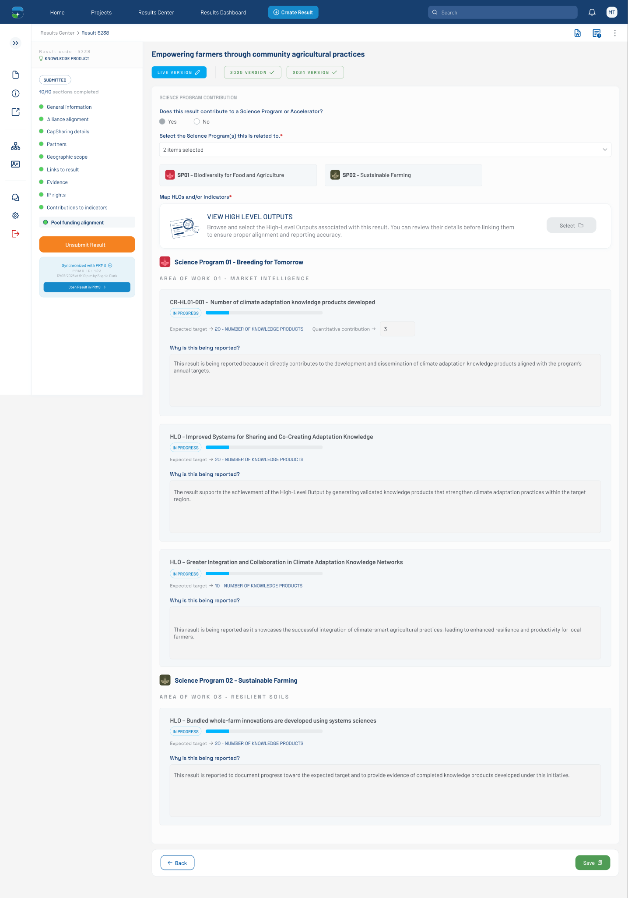

# Pool Funding Alignment — Synchronized with PRMS (Figma 33356:11736)

> **Figma node**: [`33356:11736`](https://www.figma.com/design/5a9xZJdb2rZAQm2wdk1CNT/STAR?node-id=33356-11736&m=dev) · **File key**: `5a9xZJdb2rZAQm2wdk1CNT` · **Screen tag**: `33356:11736` · **Canvas**: 1440×2056
> **Maps to Jira**: **[US5 / AC-1441](../jira-us/AC-1441-us5-push-results-prms.md)** — Push Results into the PRMS · Also documents [US2 / AC-1594](../jira-us/AC-1594-us2-pool-funding-alignment.md) "Read-only after synchronization"
> **PRMS counterpart**: [`../prms-context/frontend-context.md`](../prms-context/frontend-context.md) §12 (endpoint catalog), §16 (auth boundary)
> **Last verified**: 2026-05-15

> The **post-push state** of the bilateral mockup. The result-detail sidebar now shows a **"Synchronized with PRMS" panel** with the PRMS ID, the synchronization timestamp, the user who triggered it, and a button to open the result in PRMS. The Pool Funding Alignment form fields go **read-only** in this state.

---

## Screenshot



---

## 1. Purpose

This screen is the **terminal state** of the bilateral mockup flow. After the user pushes the result to PRMS (US5 trigger — submission / accept / manual / scheduled), the result becomes **synchronized** with PRMS:

- Form fields go read-only (per AC of US2: *"It becomes read-only after synchronization."*).
- The result-detail progress sidebar shows a **Synchronized with PRMS** banner.

---

## 2. Visual layout — the new sidebar panel

The `form_progress_knowledgeproduct` sidebar (256×808) is now fully populated:

```
┌──────────────────────────────────────┐
│ Result code #5238                    │
│ 🛡 KNOWLEDGE PRODUCT                  │
├──────────────────────────────────────┤
│ [SUBMITTED] tag                      │
│ 9/10 sections completed              │
├──────────────────────────────────────┤
│ ● General information                │
│ ● Alliance alignment                 │
│ ● CapSharing details                 │
│ ● Partners                           │
│ ● Geographic scope                   │
│ ● Links to result                    │
│ ● Evidence                           │
│ ● IP rights                          │
│ ● Contributions to indicators        │
│ ● Pool funding alignment          ★  │  ← active tab (highlighted)
├──────────────────────────────────────┤
│ [Submit Result] button               │
├──────────────────────────────────────┤
│ ✓ Synchronized with PRMS             │
│ PRMS ID: 123                         │
│ 12/02/2025 at 9:10 p.m by Sophia C.  │
│ [Open Result in PRMS →]              │
└──────────────────────────────────────┘
```

The active tab (Pool funding alignment) appears with a **`Rectangle 5736` background** indicating the highlighted state.

---

## 3. Component delta (the new pieces)

| Figma element | STAR mapping | Notes |
|---|---|---|
| **Synchronized with PRMS** banner block | **new component** — propose `prms-sync-panel` | Icon + text + meta + button |
| `check-circle` icon | primeicons `pi pi-check-circle` | Color: success green (`Green-300`) |
| `Synchronized with PRMS` label | text | Bold, primary blue |
| `PRMS ID: 123` text | text | Bound to API response `prmsResultId` |
| `12/02/2025 at 9:10 p.m by Sophia Clark` timestamp + author | formatted date + user name | Localized timezone (OQ-FIG-7) |
| `Open Result in PRMS` button | wrapped link/button | Target opens PRMS deep link in new tab |
| `arrow-right` icon | primeicons | Inside the button |
| Result tab list with **Pool funding alignment** highlighted | [`result-sidebar`](../../../../research-indicators/src/app/shared/components/result-sidebar) with new tab row | The Pool Funding Alignment tab is a new entry below "Contributions to indicators" |
| `[SUBMITTED]` tag | [`custom-tag`](../../../../research-indicators/src/app/shared/components/custom-tag) | Status tag, color: green / submitted |
| `9/10 sections completed` text | result-sidebar header text | Tracks per-result completion |

---

## 4. Verbatim text (new in this state)

| Where | Text |
|---|---|
| Result identifier | `Result code #5238` |
| Result type | `KNOWLEDGE PRODUCT` |
| Status tag | `SUBMITTED` |
| Completion text | `9/10 sections completed` |
| Sidebar tab labels (all 10) | `General information`, `Alliance alignment`, `CapSharing details`, `Partners`, `Geographic scope`, `Links to result`, `Evidence`, `IP rights`, `Contributions to indicators`, `Pool funding alignment` |
| Submit-result button | `Submit Result` |
| Sync banner heading | `Synchronized with PRMS` |
| PRMS ID line | `PRMS ID: 123` |
| Sync timestamp / author | `12/02/2025 at 9:10 p.m by Sophia Clark` |
| Open-result button | `Open Result in PRMS` |

---

## 5. States

This screen represents the **post-sync read-only** state. Transitions:

- **From any filled state (e.g., `33356:11075`)** → user / system triggers push → sync succeeds → this state.
- **Push failure** → no sync banner; the form remains editable; an error toast surfaces (see [`../prms-context/frontend-context.md`](../prms-context/frontend-context.md) §11 / §15).
- **Re-edit after sync** → depends on US2 OQ-C ("como afecta esto las versiones") — currently undefined.

---

## 6. STAR fit notes

- **`prms-sync-panel` is a new shared component.** It belongs in [`research-indicators/src/app/shared/components/`](../../../../research-indicators/src/app/shared/components/) and uses STAR's existing token system. Propose name: `prms-sync-panel`.
- Per **C-2 (Cognito + JWT)**, the **Open Result in PRMS** link points to a PRMS URL — STAR has no PRMS credentials. The link opens PRMS, where the user authenticates separately. Confirm whether the PRMS side accepts a federated deep link or whether the user re-authenticates.
- The result-detail sidebar gains a **Pool funding alignment** entry — this is the **registration of the new tab** referenced in [US2 fit notes](../jira-us/AC-1594-us2-pool-funding-alignment.md) and the canonical screen file.
- Read-only mode for the form should be implemented with **explicit `[readonly]` / `[disabled]` props**, not by flipping a global service (mirrors the PRMS anti-pattern called out in [`../prms-context/frontend-context.md`](../prms-context/frontend-context.md) §7 and §15 R3).

---

## 6b. Accessibility (WCAG 2.1 AA — PRD C-4)

- **Read-only form**: every input gets `readonly` (text) / `disabled` (controls). The page must announce the read-only state once (live region: `"This result has been synchronized to PRMS. Fields are read-only."`).
- **PRMS sync banner**: structured as a `role="status"` block so screen readers can be navigated to it via the rotor. Banner heading is an `<h2>` semantically.
- **Open Result in PRMS button**: `target="_blank"` + `rel="noopener"` + `aria-label="Open this result in PRMS — opens in a new tab"` so the new-tab behavior is announced.
- **Status tag `SUBMITTED`**: pair the green color with the literal text (don't rely on color alone).
- **Sidebar tab list**: the active **Pool funding alignment** tab gets `aria-current="page"` (or `aria-selected="true"` if using `role="tab"`).

## 7. Open questions

- **OQ-FIG-7** ([README](./README.md)): Timezone & author semantics on the sync timestamp.
- **OQ-FIG-10** ([README](./README.md)): Pool funding alignment tab placement in the result-detail sidebar — confirm order with the designer.
- **OQ-33356-11736-A**: What does the **Open Result in PRMS** button do — does it pass the STAR JWT, or is the user prompted to authenticate again in PRMS?
- **OQ-33356-11736-B**: Re-sync semantics — after the user edits a synced result, is there a re-push button visible in this panel, or does that come from the result-detail-level controls?

---

## References

- Figma: [`33356:11736`](https://www.figma.com/design/5a9xZJdb2rZAQm2wdk1CNT/STAR?node-id=33356-11736&m=dev)
- Jira: [AC-1441 (US5)](https://cgiarmel.atlassian.net/browse/AC-1441), [AC-1594 (US2)](https://cgiarmel.atlassian.net/browse/AC-1594) (read-only after sync)
- PRMS counterpart: [`../prms-context/frontend-context.md`](../prms-context/frontend-context.md) §12 (endpoint catalog), §16 (auth divergence)
- Predecessor (filled, not synced): [`33356-11075-pool-funding-alignment-filled-empty-reason.md`](./33356-11075-pool-funding-alignment-filled-empty-reason.md)
