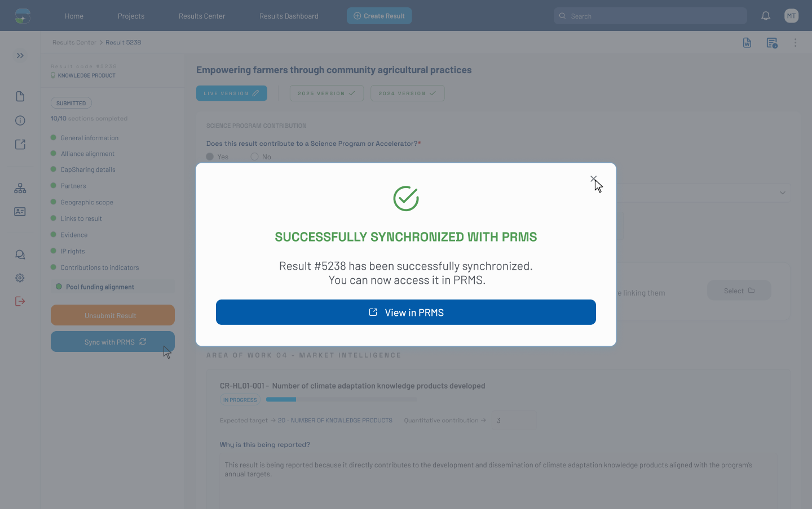

# Pool Funding Alignment — Filled Form, Above-Fold View (Figma 33356:12370)

> **Figma node**: [`33356:12370`](https://www.figma.com/design/5a9xZJdb2rZAQm2wdk1CNT/STAR?node-id=33356-12370&m=dev) · **File key**: `5a9xZJdb2rZAQm2wdk1CNT` · **Screen tag**: `33356:12370` · **Canvas**: 1440×904
> **Maps to Jira**: **[US4 / AC-1440](../jira-us/AC-1440-us4-map-results-indicators.md)**
> **Last verified**: 2026-05-15

> A **shorter (904 px)** Pool Funding Alignment screen. Note: metadata fetch failed intermittently for this node, so the structural analysis is based on visual review of the screenshot and the sibling screens.

---

## Screenshot

---

## 1. Purpose & delta

This screen is the **above-the-fold portion** of the filled mapping form ([`33356:11075`](./33356-11075-pool-funding-alignment-filled-empty-reason.md) / [`32472:129409`](./32472-129409-pool-funding-alignment-filled-with-quantitative.md)) — i.e., it captures what the user sees without scrolling.

Use this screen as the **viewport-fit reference**. It tells implementers what content must be visible in a 1440×904 viewport before scroll. The full content (taller forms) appears in the 2080-height siblings.

---

## 2. What is different

| Element | This screen | Full-height sibling (33356:11075) |
|---|---|---|
| Canvas height | 904 px (above-fold) | 2080 px |
| Visible content | Header → first SP → first AOW → first HLO card (partial) | Full hierarchy of all mapped HLOs |
| Footer options bar | likely visible at bottom | also present |

---

## 3. STAR fit notes

- Treat as a **layout reference** rather than a distinct screen. The implementation is the same as [`33356:11075`](./33356-11075-pool-funding-alignment-filled-empty-reason.md); the difference is what's visible in the viewport.
- Use this to validate that the **sticky controls** (if any) — section header, tab strip, footer actions — remain visible at this viewport size.

---

## 3b. Accessibility (WCAG 2.1 AA — PRD C-4)

- This is the viewport-fit reference; ensure that at 1440×904 the page **does not require horizontal scrolling** (PRD C-4 reflow).
- Sticky elements (if any) must not occupy more than ~25% of the viewport height to leave room for the main content.

## 4. Open questions

- **OQ-33356-12370-A**: Should any element be sticky-top within the form (e.g., the SP01 header)? The mockup doesn't indicate stickiness; confirm with the designer.

---

## References

- Figma: [`33356:12370`](https://www.figma.com/design/5a9xZJdb2rZAQm2wdk1CNT/STAR?node-id=33356-12370&m=dev)
- Jira: [AC-1440 (US4)](https://cgiarmel.atlassian.net/browse/AC-1440)
- Full-height counterparts: [`33356-11075-pool-funding-alignment-filled-empty-reason.md`](./33356-11075-pool-funding-alignment-filled-empty-reason.md), [`32472-129409-pool-funding-alignment-filled-with-quantitative.md`](./32472-129409-pool-funding-alignment-filled-with-quantitative.md)
