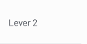

# `_table-td` Cell — "Lever 2" (Figma 33486:134021)

> **Figma node**: [`33486:134021`](https://www.figma.com/design/5a9xZJdb2rZAQm2wdk1CNT/STAR?node-id=33486-134021&m=dev) · **File key**: `5a9xZJdb2rZAQm2wdk1CNT` · **Screen tag**: `33486:134021` · **Canvas**: 115×62
> **Type**: **Component fragment** (not a full screen)
> **Maps to Jira**: ambiguous — likely a reusable table cell pattern used by [US1 / AC-1438](../jira-us/AC-1438-us1-tag-bilateral-projects.md) project listing or by the HLO modal table
> **Last verified**: 2026-05-15

> This is a **115×62 component fragment**, not a screen. It's a `_table-td` cell showing the text `Lever 2`, with a `_tree-toggler` (hidden by default). Including it in the documentation because the user explicitly listed it; flagging it for designer review since its purpose is not obvious in isolation.

---

## Screenshot

---

## 1. Purpose (best inference)

The node is named `_table-td` (lower-case `td`, leading underscore — Figma's convention for internal/component fragments). It contains:

- A `_tree-toggler` instance (24×24, hidden by default) — for expandable rows.
- A `_table-content` instance with the visible text `Lever 2`.

**Hypothesis**: this is a shared table-cell component used either in:

- **The projects-listing table** in [US1 / AC-1438](../jira-us/AC-1438-us1-tag-bilateral-projects.md) — where the "Lever" column would carry the CGIAR Strategic Lever (Levers 1–7) for each project. STAR currently has no `lever` column; this could be a new column type.
- **The HLO modal table** at [`32471:131617`](./32471-131617-hlo-modal-empty.md) — where one of the unnamed columns could be a Lever indicator (rare for ToC tables, but possible).

Without a parent context, this is **a stand-alone cell template** that should be promoted to a shared component in STAR.

---

## 2. Component inventory

| Figma element | STAR mapping | Notes |
|---|---|---|
| `_table-td` outer frame (115×62) | new shared **table-cell** component or extension of existing table-cell pattern in [`results-table`](../../../../research-indicators/src/app/shared/components/results-table) | Width is fixed; height 62 = standard row height |
| `_tree-toggler` (24×24, hidden) | wrapped chevron icon | Toggle expand/collapse |
| `_table-content` (110×15) | text element | Cell-level content slot |

---

## 3. Verbatim text

| Where | Text |
|---|---|
| Cell content | `Lever 2` |

This is a **single-row visible text**. Likely placeholder content; the actual value would come from the bound row data.

---

## 4. STAR fit notes

- If the parent table is the **projects list** (US1), this cell represents a new column: `Strategic Lever`. STAR's existing project model would need a `lever` / `strategic_lever` field, sourced from CLARISA.
- If the parent is the **HLO modal table** (US3), this cell would represent the Lever associated with an HLO; less likely but possible.
- Either way, this cell should be implemented as a **slot/template** of the parent table component — not a standalone component.
- The `_tree-toggler` hidden state suggests **some rows are expandable** (e.g., when a Lever rolls up multiple sub-items). Respect the hidden default.

---

## 5. Open questions

- **OQ-FIG-8** ([README](./README.md)): What is this cell used for? Designer clarification needed.
- **OQ-33486-134021-A**: Are CGIAR Strategic Levers a CLARISA-managed list? If yes, STAR's existing CLARISA cache services apply; if not, this is a new taxonomy.
- **OQ-33486-134021-B**: Does this fragment belong with US1's project-list scope, US3's HLO modal, or somewhere else entirely?

---

## References

- Figma: [`33486:134021`](https://www.figma.com/design/5a9xZJdb2rZAQm2wdk1CNT/STAR?node-id=33486-134021&m=dev)
- Possible parent screens: [`32471-131617-hlo-modal-empty.md`](./32471-131617-hlo-modal-empty.md) and the projects-listing screens implied by [US1 / AC-1438](../jira-us/AC-1438-us1-tag-bilateral-projects.md)
- Jira: [AC-1438 (US1)](https://cgiarmel.atlassian.net/browse/AC-1438) — see if the project-tagging Figma frame (cited in US1 as `node-id=33486-133230`) is the parent
