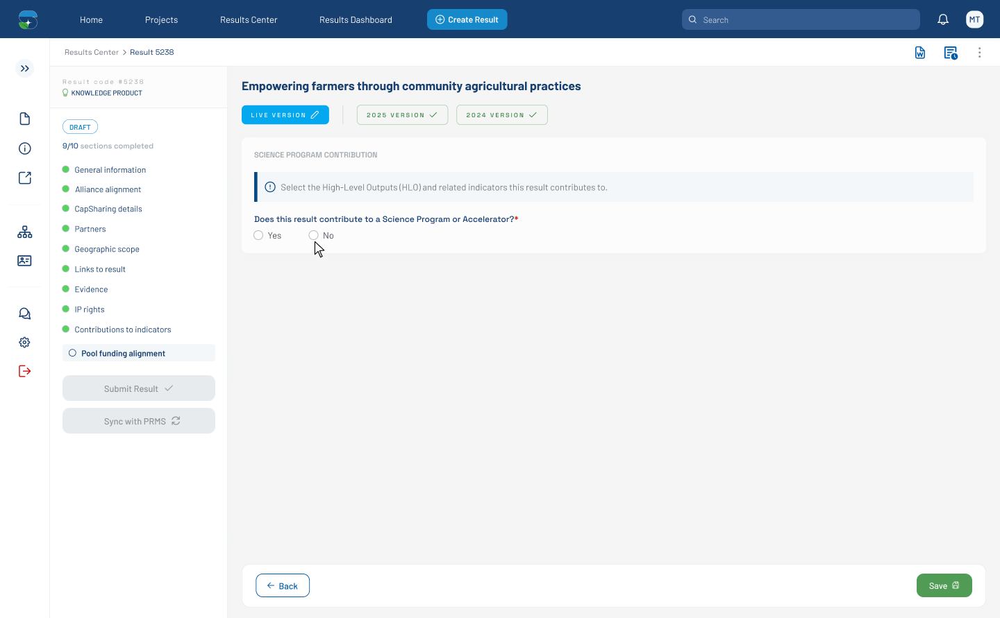

# Pool Funding Alignment — No-Branch (Figma 33528:138106)

> **Figma node**: [`33528:138106`](https://www.figma.com/design/5a9xZJdb2rZAQm2wdk1CNT/STAR?node-id=33528-138106&m=dev) · **File key**: `5a9xZJdb2rZAQm2wdk1CNT` · **Screen tag**: `33528:138106` · **Canvas**: 1440×891
> **Maps to Jira**: **[US2 / AC-1594](../jira-us/AC-1594-us2-pool-funding-alignment.md)** AC-3
> **Last verified**: 2026-05-15

> This screen lives in the bottom row of the space overview, labeled **"The result doesn't contribute to a Science Program or Accelerator"**. It documents the **No-branch terminal state**: no SP picker, no HLO picker, no indicator mapping shown.

---

## Screenshot



---

## 1. Purpose

When the user selects **No** on the contribution question, the Pool Funding Alignment section collapses to just the Yes/No question itself (per AC-3 of [US2](../jira-us/AC-1594-us2-pool-funding-alignment.md): *"If 'No' is selected for contribution, no Science Program selection is displayed."*).

---

## 2. Visual layout

```
┌──────┬─────────────────────────────────────────────────────────────┐
│ side │  Section Title                                              │
│ bar  ├─────────────────────────────────────────────────────────────│
│ clsd │  form_progress       │  Pool funding alignment tab          │
│      │                      │  H1: Empowering farmers…             │
│      │                      │  Tabs strip                          │
│      │                      │  ┌─────────────────────────────────┐ │
│      │                      │  │ SCIENCE PROGRAM CONTRIBUTION ⓘ  │ │
│      │                      │  │ ⓘ Select the High-Level…        │ │
│      │                      │  │ Does this result contribute…?*  │ │
│      │                      │  │ ( ) Yes  (●) No                 │ │
│      │                      │  └─────────────────────────────────┘ │
│      │                      │  Footer options bar (1072×75)        │
└──────┴─────────────────────────────────────────────────────────────┘
```

- The form body is shorter (167 px tall) than the Yes branches because the SP picker is not rendered.
- The Yes/No question label has the required marker `*` (same as `33528:138394`).

---

## 3. What is different from canonical

| Element | This screen | Canonical (32471:129337) |
|---|---|---|
| SP picker | ❌ not rendered | ✅ panel open |
| HLO card / picker | ❌ not rendered | ❌ (canonical also closed) |
| Footer options bar | ✅ visible | ❌ |
| Yes/No required marker | ✅ `*` | ❌ |
| Yes/No state | `No` selected | `Yes` selected |

---

## 4. Verbatim text

| Where | Text |
|---|---|
| H1 result title | `Empowering farmers through community agricultural practices` |
| Section heading | `SCIENCE PROGRAM CONTRIBUTION` |
| Info banner | `Select the High-Level Outputs (HLO) and related indicators this result contributes to.` |
| Yes/No question | `Does this result contribute to a Science Program or Accelerator?*` |
| Yes/No options | `Yes`, `No` |

---

## 5. States

This screen represents the **No-branch terminal** state. Transitions:

- User flips back to **Yes** → reveal SP multiselect → next state [`32470:3149`](./32470-3149-pool-funding-alignment-default.md) or [`32471:129337`](./32471-129337-pool-funding-alignment-sp-dropdown-open.md).
- Any previously-saved SP selections — what happens to them when the user switches to No? Confirm with BA (OQ-1594-B in [US2](../jira-us/AC-1594-us2-pool-funding-alignment.md)).

---

## 6. STAR fit notes

- Implement as a **conditional render** on the Yes/No signal: when `contributesToPoolFunding() === false`, the SP and HLO sub-sections are removed from the DOM (not just hidden) so screen readers do not announce empty regions.
- The info banner (`Select the High-Level Outputs…`) is still shown — confirm with the designer whether to suppress it on the No branch (the wording implies HLO selection is the goal of the section, which doesn't apply when No).

---

## 6b. Accessibility (WCAG 2.1 AA — PRD C-4)

- When switching Yes → No, **announce** the section change via a polite live region (e.g., `"Science Program selection hidden because the result does not contribute to Pool Funding."`).
- Conditional rendering with `*ngIf` is preferred over `[hidden]` so screen readers do not announce empty regions.
- Focus order after switching: Yes radio → No radio → next focusable control beyond the section (e.g., the Save button in the footer).

## 7. Open questions

- **OQ-33528-138106-A**: Should the info banner be hidden on the No branch?
- **OQ-33528-138106-B**: Confirm cascade behavior when switching from Yes (with selected SPs) → No.

---

## References

- Figma: [`33528:138106`](https://www.figma.com/design/5a9xZJdb2rZAQm2wdk1CNT/STAR?node-id=33528-138106&m=dev)
- Jira: [AC-1594](https://cgiarmel.atlassian.net/browse/AC-1594) AC-3
- Yes-branch sibling: [`32470-3149-pool-funding-alignment-default.md`](./32470-3149-pool-funding-alignment-default.md)
- Canonical: [`32471-129337-pool-funding-alignment-sp-dropdown-open.md`](./32471-129337-pool-funding-alignment-sp-dropdown-open.md)
