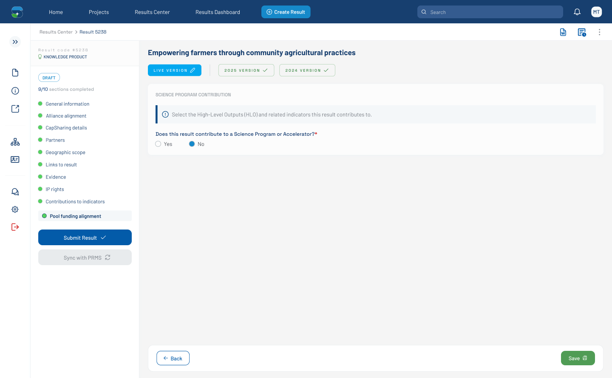

# Pool Funding Alignment — Default (required marker on Yes/No) (Figma 33528:138394)

> **Figma node**: [`33528:138394`](https://www.figma.com/design/5a9xZJdb2rZAQm2wdk1CNT/STAR?node-id=33528-138394&m=dev) · **File key**: `5a9xZJdb2rZAQm2wdk1CNT` · **Screen tag**: `33528:138394` · **Canvas**: 1440×891
> **Maps to Jira**: **[US2 / AC-1594](../jira-us/AC-1594-us2-pool-funding-alignment.md)**
> **Last verified**: 2026-05-15

> Variant of the entry-state form ([`32470:3149`](./32470-3149-pool-funding-alignment-default.md)) where the **Yes/No question carries a required marker (`*`)**.

---

## Screenshot

---

## 1. Purpose & delta

This is essentially the same screen as [`32470:3149`](./32470-3149-pool-funding-alignment-default.md) but the Yes/No question label reads `Does this result contribute to a Science Program or Accelerator?*` — the trailing `*` denotes a required field. All other content is identical.

The presence of two screens that differ only by this single character is a design indicator that the **required-marker placement** is still being decided. This is **[OQ-FIG-1](./README.md)** in the README.

---

## 2. Component delta

| Element | This screen | Sibling 32470:3149 |
|---|---|---|
| Yes/No question label | `Does this result contribute to a Science Program or Accelerator?*` | `Does this result contribute to a Science Program or Accelerator?` |
| Width of question label | 381 px (longer to accommodate `*`) | 375 px |
| Everything else | identical | identical |

---

## 3. Verbatim text

| Where | Text |
|---|---|
| H1 result title | `Empowering farmers through community agricultural practices` |
| Section heading | `SCIENCE PROGRAM CONTRIBUTION` |
| Info banner | `Select the High-Level Outputs (HLO) and related indicators this result contributes to.` |
| Yes/No question | `Does this result contribute to a Science Program or Accelerator?*` |
| Yes/No options | `Yes`, `No` |

---

## 4. STAR fit notes

- The required marker (`*`) should be **rendered consistently** in STAR (e.g., a `*` next to the label). Per **C-4 (WCAG 2.1 AA)**, also expose `aria-required="true"` on the radio group and `required` on the input.
- Whether this field is actually required depends on the broader form rules — Jira AC-7 of US2 says the alignment fields are **not part of the submission validator**. The `*` here may indicate "required to proceed within the section" rather than "required to submit the result".

---

## 5. Open questions

- **OQ-FIG-1** ([README](./README.md)): Required-marker placement — confirm with the designer/BA.
- **OQ-33528-138394-A**: If the Yes/No question is required to proceed within the tab but not for submission, surface the inline-validation copy ("Please answer this question to continue") and treat as a soft block.

---

## References

- Figma: [`33528:138394`](https://www.figma.com/design/5a9xZJdb2rZAQm2wdk1CNT/STAR?node-id=33528-138394&m=dev)
- Jira: [AC-1594](https://cgiarmel.atlassian.net/browse/AC-1594)
- Sibling: [`32470-3149-pool-funding-alignment-default.md`](./32470-3149-pool-funding-alignment-default.md) (without `*`)
- Canonical: [`32471-129337-pool-funding-alignment-sp-dropdown-open.md`](./32471-129337-pool-funding-alignment-sp-dropdown-open.md)
