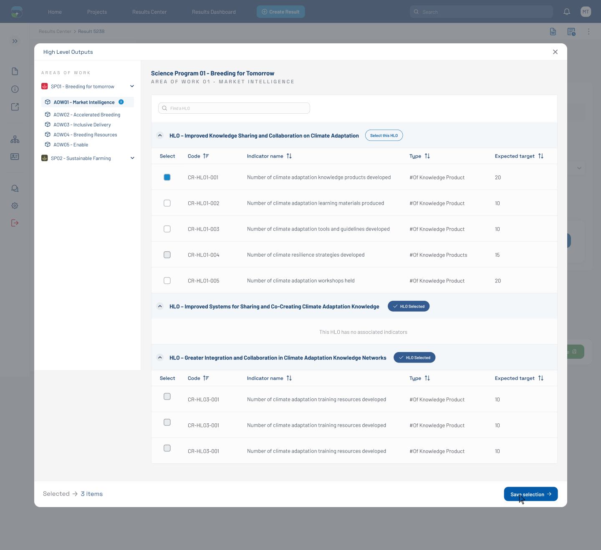

# HLO Modal — 3 Items Selected (Figma 33563:137770)

> **Figma node**: [`33563:137770`](https://www.figma.com/design/5a9xZJdb2rZAQm2wdk1CNT/STAR?node-id=33563-137770&m=dev) · **File key**: `5a9xZJdb2rZAQm2wdk1CNT` · **Screen tag**: `33563:137770` · **Canvas**: 1440×1320
> **Maps to Jira**: **[US4 / AC-1440](../jira-us/AC-1440-us4-map-results-indicators.md)** — Map results to indicators
> **Last verified**: 2026-05-15

> Variant of [`32471:131617`](./32471-131617-hlo-modal-empty.md) that shows the modal **with 3 indicators selected**, an in-progress "add to selection" button visible, and a **badge with the count "3"** on the active AOW item.

---

## Screenshot

---

## 1. Purpose & delta

Same modal shell, but reflects the **user mid-flow**:

- The active AOW in the sidebar (`AOW01 - Market Intelligence`) now shows a small badge with `3` items — see `Frame 1171276881` (12×12 px badge at x=176).
- The footer counter reads `Selected → 3 items` (vs `0 items` in the empty state).
- Two of the table-body rows show a **green check-button** (`button` containing a `check` icon + the word `Button`, 100×26). These are the **per-row commit buttons** — clicking adds the row's indicator to the selection.

This is the screen that drives [US4 / AC-1440 (mapping rules + contribution)](../jira-us/AC-1440-us4-map-results-indicators.md).

---

## 2. Component delta

| Figma element | STAR mapping | Notes |
|---|---|---|
| Per-AOW selection badge (`Frame 1171276881`, 12×12 with `3`) | extend [`custom-tag`](../../../../research-indicators/src/app/shared/components/custom-tag) into a numeric counter chip | Bound to `selected.count[aowId]` |
| Per-row commit button (`button` 100×26, green) | wrapped button with check icon | Affirmative action — click to add row to selection |
| Selected row visual state | background `Light Blue-100` (or similar selected tint) | Confirm color in Figma |
| Footer counter "3 items" | bound to selected count | Already documented in `32471:131617` |

---

## 3. Verbatim text (delta)

| Where | Text |
|---|---|
| Footer counter | `Selected` + `3 items` |
| Per-row commit button label | `Button` *(placeholder copy — confirm with designer; likely `Add` or `Select`)* |
| Badge value | `3` |

---

## 4. States

This screen captures **3 items selected** state. Transitions:

- User clicks a row's commit button → selection count +1; row checkbox checked; counter updates; AOW badge updates.
- User clicks again (or unchecks) → -1.
- User reaches the **footer buttons** (Cancel / Confirm) — confirming closes the modal and writes the selection back to the form (see [`33356:11075`](./33356-11075-pool-funding-alignment-filled-empty-reason.md) for the post-confirm state).

---

## 5. STAR fit notes

- The placeholder text `Button` is **definitely a mockup placeholder** — needs final copy. Propose `Add` (active row) / `Added` (already-selected row).
- Selection state should round-trip to the result's persisted `result_pool_funding_indicator` list (proposed in [US4](../jira-us/AC-1440-us4-map-results-indicators.md) §5).
- Per **C-4 (WCAG 2.1 AA)**: the counter badge must have an `aria-label="<n> indicators selected in AOW01 - Market Intelligence"` so screen readers can announce changes.

---

## 6. Open questions

- **OQ-33563-137770-A**: Confirm per-row commit button copy (`Add` vs `Select` vs `Map`).
- **OQ-33563-137770-B**: When the user closes the modal without confirming, are selections preserved (draft) or discarded?

---

## References

- Figma: [`33563:137770`](https://www.figma.com/design/5a9xZJdb2rZAQm2wdk1CNT/STAR?node-id=33563-137770&m=dev)
- Jira: [AC-1440 (US4)](https://cgiarmel.atlassian.net/browse/AC-1440)
- Parent modal: [`32471-131617-hlo-modal-empty.md`](./32471-131617-hlo-modal-empty.md)
- Sibling: [`33563-138613-hlo-modal-disabled-reason.md`](./33563-138613-hlo-modal-disabled-reason.md)
- Successor (form, post-modal-confirm): [`33356-11075-pool-funding-alignment-filled-empty-reason.md`](./33356-11075-pool-funding-alignment-filled-empty-reason.md)
