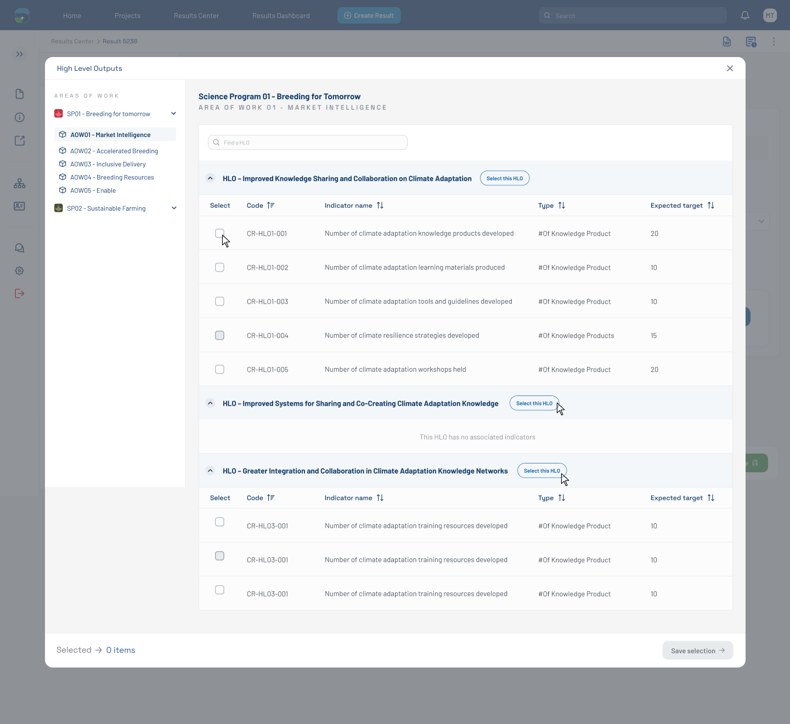

# HLO Modal — Disabled Indicator with Reason Tooltip (Figma 33563:138613)

> **Figma node**: [`33563:138613`](https://www.figma.com/design/5a9xZJdb2rZAQm2wdk1CNT/STAR?node-id=33563-138613&m=dev) · **File key**: `5a9xZJdb2rZAQm2wdk1CNT` · **Screen tag**: `33563:138613` · **Canvas**: 1440×1320
> **Maps to Jira**: **[US3 / AC-1439](../jira-us/AC-1439-us3-display-toc-indicators.md)** + **[US4 / AC-1440 (rules)](../jira-us/AC-1440-us4-map-results-indicators.md)** OQ-G
> **Last verified**: 2026-05-15

> Variant of [`32471:131617`](./32471-131617-hlo-modal-empty.md) that shows the **disabled-indicator with reason** state — a tooltip / inline message reveals why a specific indicator **cannot be mapped** to the current result.

---

## Screenshot

---

## 1. Purpose & delta

Same modal as `32471:131617`. The distinctive element is a small floating callout (`Frame "text"`, 259×26 at x=252, y=465) containing:

> `This indicator cannot be mapped to this result because...`

This is the **disabled-indicator reason** tooltip — a critical UX moment for [US4](../jira-us/AC-1440-us4-map-results-indicators.md)'s validation rules. It implies the modal renders **business-rule reasons** for indicator disablement, e.g., the indicator belongs to an SP not selected in US2, or violates a cardinality rule.

---

## 2. Component delta

| Figma element | STAR mapping | Notes |
|---|---|---|
| Reason callout (`Frame "text"`, 259×26) | new pattern — propose `disabled-indicator-tooltip` or extend [`alert-tag`](../../../../research-indicators/src/app/shared/components/alert-tag) | Inline near the disabled row; PrimeNG `p-tooltip` or `p-popover` is the natural primitive |
| Decorative `image 21` (28×28) | icon next to the disabled row | Probably a "info" or "lock" indicator |

---

## 3. Verbatim text (delta)

| Where | Text |
|---|---|
| Reason callout | `This indicator cannot be mapped to this result because...` |

The literal text uses `...` as a placeholder — the actual copy must come from the BA per indicator-specific rule.

---

## 4. States

This screen captures the **disabled-indicator** state:

- Indicator row is rendered greyed-out / non-interactive.
- Hovering or focusing the row surfaces the reason callout.
- Clicking the disabled checkbox is a no-op; the screen reader announces the reason text.

---

## 5. STAR fit notes

- The reason copy is **dynamic** — store the reason on the indicator record returned by the API. Frontend simply renders.
- Per **C-4 (WCAG 2.1 AA)**, the reason must be **available via keyboard** (not just hover). Use `p-tooltip` with `tooltipEvent="both"` (hover + focus), or place the reason in an `aria-describedby` text that always exists in the DOM.
- The reason text should not rely on color alone — pair the disabled-row visual with a lock or info icon (`image 21` in the mockup).

---

## 6. Open questions

- **OQ-FIG-4** ([README](./README.md)): Where do the indicator disablement rules come from? Backend per result? CLARISA flags? US4 contribution rules (OQ-G)?
- **OQ-33563-138613-A**: Confirm copy template — is the placeholder `...` filled by a single dynamic phrase, or do we need a localized template per rule type?
- **OQ-33563-138613-B**: Should the tooltip auto-show on first encounter, or only on focus/hover?

---

## References

- Figma: [`33563:138613`](https://www.figma.com/design/5a9xZJdb2rZAQm2wdk1CNT/STAR?node-id=33563-138613&m=dev)
- Jira: [AC-1439 (US3)](https://cgiarmel.atlassian.net/browse/AC-1439), [AC-1440 (US4)](https://cgiarmel.atlassian.net/browse/AC-1440)
- Parent modal: [`32471-131617-hlo-modal-empty.md`](./32471-131617-hlo-modal-empty.md)
- Selected-items sibling: [`33563-137770-hlo-modal-3-items-selected.md`](./33563-137770-hlo-modal-3-items-selected.md)
