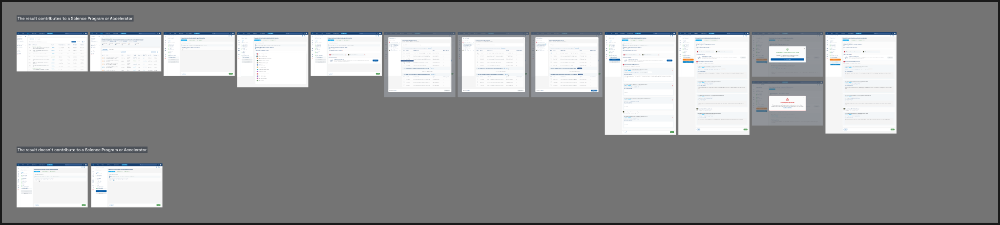

# Bilateral Module — Figma Mockups (Visual Reference)

> **Audience**: STAR product, design, and engineering implementing the bilateral module.
> **Source**: Figma file `5a9xZJdb2rZAQm2wdk1CNT`, space [`32470:3144`](https://www.figma.com/design/5a9xZJdb2rZAQm2wdk1CNT/STAR?node-id=32470-3144&m=dev) (CGIAR/STAR — Alliance Account `IBD`).
> **Status**: Senior-frontend synthesis. Each per-screen file is paired with a PNG in `_assets/`. The Figma file is the live source of truth; the PNGs here are the durable snapshot.
> **Last verified**: 2026-05-15

> **▶ CURRENT CANON (2026-06-10 — ToC Mapping v2).** The Pool Funding Alignment flow is now the **inline per-SP ToC cascade** (Level → High-Level Output → Indicator → quantitative contribution vs the 2026 target). The current canonical screens are the four `_assets/Pool funding alignment.png`, `…1.png`, `…2.png`, `…3.png`, implemented by [`../toc-mapping-v2/`](../toc-mapping-v2/). **Superseded:** every node-id screen below that shows the **HLO selection modal**, the **"VIEW HIGH LEVEL OUTPUTS" action card**, or the `(SP, AOW)`-pair / reason-dropdown model (e.g. `32471:131617`, `32472:129409`, `33356:11075`, `33356:12370`, `33563:137770`, `33563:138613`) is **historical** — that modal flow was retired (spec `toc-mapping-v2` T-BIL-TM2-05). The remaining per-screen notes are kept for lineage; consult the four canon PNGs + `toc-mapping-v2` for current behavior.

---

## 1. Space at a glance

The space is laid out as two parallel storyboards:

1. **"The result contributes to a Science Program or Accelerator"** (top row) — the **Yes** branch: empty form → SP dropdown → HLO selection modal → filled mapping form → synchronized with PRMS.
2. **"The result doesn't contribute to a Science Program or Accelerator"** (bottom row) — the **No** branch: minimal form variant where the SP/HLO fields stay hidden.

This is the visual counterpart of **[US2 / AC-1594 Pool Funding Alignment](../jira-us/AC-1594-us2-pool-funding-alignment.md)** plus the deeper indicator mapping work in **[US3 / AC-1439](../jira-us/AC-1439-us3-display-toc-indicators.md)** and **[US4 / AC-1440](../jira-us/AC-1440-us4-map-results-indicators.md)**, and surfaces the PRMS-sync state described in **[US5 / AC-1441](../jira-us/AC-1441-us5-push-results-prms.md)**.

---

## 2. How to use this folder

- Each Figma node provided by the BA / designer is documented in its own file: `<node-id>-<slug>.md`.
- The matching screenshot is in `_assets/<node-id>.png` and is **embedded** in the per-screen file.
- Per-screen files capture: visual layout, component inventory mapped to STAR shared components, design tokens, states, interactions, verbatim copy, accessibility notes, STAR fit notes, and open questions.
- For pixel fidelity, **always open the PNG side-by-side with the implementation** and treat the PNG as authoritative. The text doc captures the structural / semantic intent.
- When designs change in Figma, re-fetch the node and replace the PNG; bump "Last verified" on the per-screen file.

---

## 3. Screen index

All 14 user-provided nodes + the space-overview.

| Tag (node ID) | File | Type | Branch | State / variant | Maps to Jira US |
|---|---|---|---|---|---|
| `32470:3144` | inline above | Space overview | — | All states laid out | — |
| `32470:3149` | [→](./32470-3149-pool-funding-alignment-default.md) | Screen (1440×891) | Yes | **Default form, no SP selected yet** (Yes/No radio not required marker) | [US2](../jira-us/AC-1594-us2-pool-funding-alignment.md) |
| `33528:138394` | [→](./33528-138394-pool-funding-alignment-default-required.md) | Screen (1440×891) | Yes | **Default form, required marker shown** (`*` on the Yes/No question) | [US2](../jira-us/AC-1594-us2-pool-funding-alignment.md) |
| `32471:129337` | [→](./32471-129337-pool-funding-alignment-sp-dropdown-open.md) | Screen (1440×1120) | Yes | **SP dropdown OPEN** — all 13 Science Programs visible | [US2](../jira-us/AC-1594-us2-pool-funding-alignment.md) |
| `32471:129636` | [→](./32471-129636-pool-funding-alignment-sp-selected-hlo-prompt.md) | Screen (1440×891) | Yes | **SP selected; "Map HLOs and/or indicators*" prompt + AI card with "View High Level Outputs"** | [US2](../jira-us/AC-1594-us2-pool-funding-alignment.md) → [US3](../jira-us/AC-1439-us3-display-toc-indicators.md) |
| `32471:131617` | [→](./32471-131617-hlo-modal-empty.md) | Screen (1440×1320) | Yes | **HLO selection modal OPEN — Areas of Work tree, 0 items selected** | [US3](../jira-us/AC-1439-us3-display-toc-indicators.md) |
| `33563:138613` | [→](./33563-138613-hlo-modal-disabled-reason.md) | Screen (1440×1320) | Yes | **HLO modal — disabled indicator with "This indicator cannot be mapped to this result because..." reason** | [US3](../jira-us/AC-1439-us3-display-toc-indicators.md) + [US4 rules](../jira-us/AC-1440-us4-map-results-indicators.md) |
| `33563:137770` | [→](./33563-137770-hlo-modal-3-items-selected.md) | Screen (1440×1320) | Yes | **HLO modal — 3 items selected (badge "3" on AOW01); add-to-cart-style action button** | [US4](../jira-us/AC-1440-us4-map-results-indicators.md) |
| `33356:11075` | [→](./33356-11075-pool-funding-alignment-filled-empty-reason.md) | Screen (1440×2080) | Yes | **Filled mapping form — Empty form** (multiple SPs+AOWs, HLO cards with "Expected target", "Why is this being reported?" dropdowns) | [US4](../jira-us/AC-1440-us4-map-results-indicators.md) |
| `32472:129409` | [→](./32472-129409-pool-funding-alignment-filled-with-quantitative.md) | Screen (1440×2080) | Yes | **Filled form variant with "Quantitative contribution" field active on the first indicator** | [US4](../jira-us/AC-1440-us4-map-results-indicators.md) |
| `33356:12370` | [→](./33356-12370-pool-funding-alignment-filled-reason.md) | Screen (1440×904) | Yes | **Filled form — Above-fold view with filled reason** (top portion) | [US4](../jira-us/AC-1440-us4-map-results-indicators.md) |
| `33356:11736` | [→](./33356-11736-pool-funding-alignment-synchronized.md) | Screen (1440×2056) | Yes | **Filled form + result sidebar showing "Synchronized with PRMS, PRMS ID: 123" panel and "Open Result in PRMS" link** | [US5](../jira-us/AC-1441-us5-push-results-prms.md) |
| `33528:138106` | [→](./33528-138106-pool-funding-alignment-no-branch.md) | Screen (1440×891) | **No** | **No-branch form — "No" selected; no SP/HLO fields shown** | [US2](../jira-us/AC-1594-us2-pool-funding-alignment.md) |
| `33486:134021` | [→](./33486-134021-table-td-lever-cell.md) | Component fragment (115×62) | — | **`_table-td` cell showing "Lever 2"** — a reusable table cell with tree-toggler | Reusable component |
| `33356:13686` | [→](./33356-13686-empty-internal-node.md) | Internal/empty (1440×904) | — | **Empty placeholder node** (no visible content — possibly an internal Figma artifact) | None |

> All 14 specific nodes share the file key `5a9xZJdb2rZAQm2wdk1CNT`. URL pattern: `https://www.figma.com/design/5a9xZJdb2rZAQm2wdk1CNT/STAR?node-id=<node-id>&m=dev`.

---

## 4. Recommended reading order

Follow the user-journey order, which mirrors the Jira US dependency graph in [`../jira-us/README.md`](../jira-us/README.md) §4:

1. **`32470:3149`** — empty form, the entry point of the section.
2. **`33528:138394`** — same empty form with required-marker emphasis on the Yes/No question.
3. **`33528:138106`** — what the section looks like in the **No** branch.
4. **`32471:129337`** — opening the SP dropdown.
5. **`32471:129636`** — after picking SPs; the HLO prompt appears.
6. **`32471:131617`** — clicking "View High Level Outputs" opens the modal.
7. **`33563:138613`** — disabled-indicator state in the modal (rules / constraints visible).
8. **`33563:137770`** — items selected in the modal; ready to confirm.
9. **`33356:11075`** — back on the form, indicators mapped per SP / AOW.
10. **`33356:12370`** — same filled form, narrower viewport.
11. **`32472:129409`** — filled form with the quantitative-contribution sub-field.
12. **`33356:11736`** — filled form + the **Synchronized with PRMS** indicator in the result-detail sidebar.

The two remaining nodes are reference artifacts:

- **`33486:134021`** — a `_table-td` component fragment; treat as a shared cell pattern.
- **`33356:13686`** — empty node; document but skip in implementation.

---

## 5. Design tokens at a glance

Pulled from `get_variable_defs` on the canonical screen `32471:129337`. The Figma palette is **already aligned with STAR's `--ac-*` token system** — implementation is a 1:1 mapping, not a re-theming exercise.

| Figma variable | Hex | STAR token (`--ac-*`) | Utility class |
|---|---|---|---|
| `Primary Blue-500` | `#173F6F` | `--ac-primary-blue-500` | `.abc-primary-blue-500` / `.atc-primary-blue-500` |
| `Primary Blue-400` | `#153C71` | `--ac-primary-blue-400` | `.abc-primary-blue-400` / `.atc-primary-blue-400` |
| `Primary Blue-300` | `#345B8F` | `--ac-primary-blue-300` | `.abc-primary-blue-300` / `.atc-primary-blue-300` |
| `Light Blue-300` | `#1689CA` | `--ac-light-blue-300` | `.abc-light-blue-300` / `.atc-light-blue-300` |
| `Light Blue-400` | `#035BA9` | `--ac-light-blue-400` | `.abc-light-blue-400` / `.atc-light-blue-400` |
| `Light Blue-500` | `#074B86` | `--ac-light-blue-500` | `.abc-light-blue-500` / `.atc-light-blue-500` |
| `Green-200` | `#A8CEAB` | `--ac-green-200` | `.abc-green-200` / `.atc-green-200` |
| `Green-300` | `#7CB580` | `--ac-green-300` | `.abc-green-300` / `.atc-green-300` |
| `Red-1` | `#CF0808` | `--ac-red-1` | `.abc-red-1` / `.atc-red-1` |
| `Grey-100` | `#F4F7F9` | `--ac-grey-100` | `.abc-grey-100` / `.atc-grey-100` |
| `Grey-200` / `Grey-300` | `#E8EBED` | `--ac-grey-200` / `--ac-grey-300` | — |
| `Grey-400` | `#B9C0C5` | `--ac-grey-400` | — |
| `Grey-500` | `#A2A9AF` | `--ac-grey-500` | — |
| `Grey-600` | `#8D9299` | `--ac-grey-600` | — |
| `Grey-700` | `#777C83` | `--ac-grey-700` | — |
| `Grey-800` | `#4C5158` | `--ac-grey-800` | — |
| `White-1` | `#FFFFFF` | `--ac-white-1` | — |
| `White-2` | `#FCFCFC` | `--ac-white-2` | — |
| `Background` | `#F5F5F5` | `--ac-background` | — |
| `message/info/icon/color` | `#3B82F6` | (no `--ac-*` match — gap, propose new info-icon token) | — |
| `input/icon/color` | `#6B7280` | (close to `--ac-grey-600` / `-700`, propose semantic alias) | — |
| `surface/900` | `#212121` | (gap — propose `--ac-surface-900` for dark surfaces) | — |
| `badge/color` | `#FFFFFF` | `--ac-white-1` | — |

**Conclusion**: The Figma palette is the STAR palette with **three minor token gaps** that should be added during implementation (info icon, input icon semantic alias, surface 900). All other colors map 1:1.

See [`../../../system-design/design.md`](../../../system-design/design.md) §7 for the canonical STAR token reference and [`../../../../research-indicators/README.md`](../../../../research-indicators/README.md) for the full utility-class reference.

---

## 6. Component coverage summary

These STAR shared components cover most of what the mockups need (all verified to exist in `research-indicators/src/app/shared/components/`):

| Mockup element | STAR shared component | PrimeNG primitive |
|---|---|---|
| Top app bar ("Header new") | [`alliance-navbar`](../../../../research-indicators/src/app/shared/components/alliance-navbar) | — |
| Collapsed left side bar | [`alliance-sidebar`](../../../../research-indicators/src/app/shared/components/alliance-sidebar) | — |
| Section title ("Section Title") | [`section-header`](../../../../research-indicators/src/app/shared/components/section-header) | — |
| Result-tab progress sidebar (`form_progress_knowledgeproduct`) | [`result-sidebar`](../../../../research-indicators/src/app/shared/components/result-sidebar) | — |
| Tabs live version (Pool funding alignment tab strip) | tab pattern via [`navigation-buttons`](../../../../research-indicators/src/app/shared/components/navigation-buttons) | `p-tabs` (wrapped) |
| Yes/No radio row | [`custom-fields`](../../../../research-indicators/src/app/shared/components/custom-fields) | `p-radiobutton` (wrapped) |
| SP multi-select dropdown | [`dropdowns`](../../../../research-indicators/src/app/shared/components/dropdowns) (multi-select variant) | `p-multiselect` (wrapped) |
| Status / progress tag ("IN PROGRESS", "SUBMITTED") | [`custom-tag`](../../../../research-indicators/src/app/shared/components/custom-tag) | — |
| Progress bar | [`custom-progress-bar`](../../../../research-indicators/src/app/shared/components/custom-progress-bar) | `p-progressbar` |
| HLO selection modal | [`all-modals`](../../../../research-indicators/src/app/shared/components/all-modals) + [`modal`](../../../../research-indicators/src/app/shared/components/modal) host | `p-dialog` (wrapped) |
| Footer options bar | [`navigation-buttons`](../../../../research-indicators/src/app/shared/components/navigation-buttons) / [`form-header`](../../../../research-indicators/src/app/shared/components/form-header) | — |
| Synchronized-with-PRMS panel | new component (per-screen note) | — |
| AI card / "View High Level Outputs" prompt block | new component (per-screen note) — review whether this is reusable | — |
| Dataview list of HLOs / indicators | [`metadata-panel`](../../../../research-indicators/src/app/shared/components/metadata-panel) pattern + `p-dataview` | `p-dataview` (wrapped) |
| Reason / "Why is this being reported?" select | [`dropdowns`](../../../../research-indicators/src/app/shared/components/dropdowns) (single-select with search) | `p-multiselect` |

**New components likely needed**:
- The **AI card / Upload-file teaser** that promotes "VIEW HIGH LEVEL OUTPUTS" (icon + heading + body text + green button). Reusable pattern — propose a `pr-action-card` or extend `metadata-panel`.
- The **Synchronized-with-PRMS** result-sidebar block (icon, success text, PRMS ID, timestamp, "Open Result in PRMS" link).
- The **disabled-indicator-with-reason** tooltip/inline message in the HLO modal.

---

## 7. Open questions roll-up

Aggregated across all per-screen `§10` sections.

- **OQ-FIG-1**: When does the **required marker (`*`) appear** on the "Does this result contribute…" question? `32470:3149` shows it without `*`; `33528:138394` shows it with. Confirm which is canonical.
- **OQ-FIG-2**: The SP-dropdown options are shown alphabetically (`SP01 → SP13`) — confirm the source order (CLARISA? service-defined?). Star icons are present-but-hidden in the metadata — are SPs **favorable / starred**?
- **OQ-FIG-3**: HLO modal sidebar shows "Areas of Work" (e.g., `AOW01 - Market Intelligence`) under each SP. How do AOWs relate to ToC levels in `prms-context/frontend-context.md` §6.5? Confirm taxonomy with the BA.
- **OQ-FIG-4**: The HLO modal includes a **disabled-indicator hover tip** ("This indicator cannot be mapped to this result because…"). Where do the rules originate (US4 contribution rules — OQ-G)?
- **OQ-FIG-5**: The "Upload file" green button on the AI card is unexpected for "VIEW HIGH LEVEL OUTPUTS". Is this a copy-paste error in the mockup, or is there an upload-evidence step at this point of the flow?
- **OQ-FIG-6**: `33356:11075` shows two SPs (Breeding for Tomorrow, Sustainable Farming) each with their AOW + indicator cards — is the grouping hierarchical (SP → AOW → HLO) or flat?
- **OQ-FIG-7**: "Synchronized with PRMS" appears on `33356:11736` with `PRMS ID: 123, 12/02/2025 at 9:10 p.m by Sophia Clark`. Is the timestamp localized to the user's TZ, and is "by <user>" the synchronizer or the original author?
- **OQ-FIG-8**: Two nodes (`33486:134021` `_table-td "Lever 2"`, and `33356:13686` empty) appear as references. Confirm with the designer whether they should be promoted to documented components or removed from the link list.
- **OQ-FIG-9**: A new token family (info icon `#3B82F6`, input icon `#6B7280`, surface 900 `#212121`) doesn't exist in STAR. Add to the design-system roadmap (system-design §12 Decision Record).
- **OQ-FIG-10**: The "Pool funding alignment" tab is shown highlighted in the **result-detail progress sidebar** (`33356:11736`) — confirm placement order in the existing result tabs (between "Contributions to indicators" and the submit button in this mockup).

---

## 8. How this feeds the SDD spec

These per-screen files inform — but do not replace — the canonical SDD docs at:

- `docs/specs/bilateral-module/requirements.md` — visual acceptance criteria can cite specific nodes (e.g., `AC-2.3 (mockup 32471:129337)`).
- `docs/specs/bilateral-module/design.md` — §4 (frontend architecture) draws on the component-coverage summary in §6 of this file; §11 (decision record) should capture the **three new tokens** flagged in §5.
- `docs/specs/bilateral-module/task.md` — implementation tasks can reference per-screen files as visual ACs.

Methodology templates: [`../../general-setup/`](../../general-setup/).

---

## 9. Sources

- Figma file: `5a9xZJdb2rZAQm2wdk1CNT` — STAR design system.
- Space: [`32470:3144`](https://www.figma.com/design/5a9xZJdb2rZAQm2wdk1CNT/STAR?node-id=32470-3144&m=dev).
- Sibling context corners:
  - [`../jira-us/`](../jira-us/) — the BA-authored user stories.
  - [`../prms-context/frontend-context.md`](../prms-context/frontend-context.md) — the PRMS-side counterpart.
- STAR constitutional baseline:
  - [`../../../prd.md`](../../../prd.md) §3 personas, §8.3 constraints (especially **C-3 CLARISA**, **C-4 WCAG 2.1 AA**, **C-6 lazy standalone**).
  - [`../../../system-design/design.md`](../../../system-design/design.md) §7 tokens, §8 component inventory.
  - [`../../../detailed-design/detailed-design.md`](../../../detailed-design/detailed-design.md) §2 modules, §6 state.
- SDD methodology: [`../../general-setup/`](../../general-setup/).
